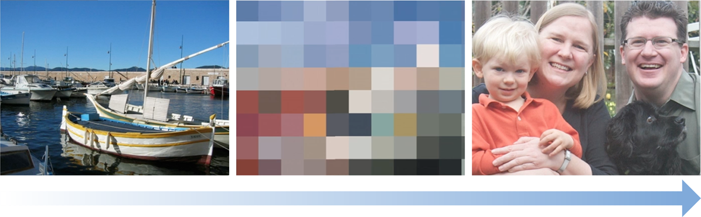

# 子类化滤镜

子类化滤镜的步骤：

* 生命滤镜的输入参数，输入参数的前缀为“input”，例如```inputImage```。

* 如果必要的话，重写```setDefaults```方法。

* 重写```outputImage```方法。

## 色键滤镜

从图片中删除一个或者一个范围的颜色，然后将原图和背景图合成。


创建色键滤镜：

* 创建颜色数据的cube map，将要删除的颜色值设置为透明（alpha值为0.0）。
* 使用CIColorCube滤镜和数据映射，从源图中删除色度键颜色。
* 使用CISourceOverCompositing滤镜将处理的源图像与背景图像混合。

### 创建cube map
彩色立方体是一个3D颜色查找表。 CIColorCube将颜色值作为输入，并将一个查找表应用于值。 CIColorCube的默认查找表是一个标识矩阵，这意味着它不提供任何数据。 但是，该配方要求从图像中删除所有绿色。 （如果愿意，可以删除其他颜色。）

需要将图片中所有的绿色的alpha=0，green是一个颜色区间。最直接的转换方法是将颜色从RGBA转为HSV。在HSV中，色调被表示为围绕圆柱体的中心轴线的角度。 在该表示中，您可以将颜色可视化为饼图，然后简单地删除表示色键颜色的切片。

要删除绿色，您需要定义包含绿色色调的中央访问周围的最小和最大角度。 然后，对于任何绿色的，您将其alpha值设置为0.0。 纯绿色值相当于120º。 最小和最大角度需要围绕该值居中。

cube map数据必须预乘alpha，所以创建多维数据集映射的最后一步是将RGB值乘以刚刚计算出的alpha值，对于绿色色调为0.0，否则为1.0。

```
// Allocate memory
const unsigned int size = 64;
float *cubeData = (float *)malloc (size * size * size * sizeof (float) * 4);
float rgb[3], hsv[3], *c = cubeData;

// Populate cube with a simple gradient going from 0 to 1
for (int z = 0; z < size; z++){
    rgb[2] = ((double)z)/(size-1); // Blue value
    for (int y = 0; y < size; y++){
        rgb[1] = ((double)y)/(size-1); // Green value
        for (int x = 0; x < size; x ++){
            rgb[0] = ((double)x)/(size-1); // Red value
            // Convert RGB to HSV
            // You can find publicly available rgbToHSV functions on the Internet
            rgbToHSV(rgb, hsv);
            // Use the hue value to determine which to make transparent
            // The minimum and maximum hue angle depends on
            // the color you want to remove
            float alpha = (hsv[0] > minHueAngle && hsv[0] < maxHueAngle) ? 0.0f: 1.0f;
            // Calculate premultiplied alpha values for the cube
            c[0] = rgb[0] * alpha;
            c[1] = rgb[1] * alpha;
            c[2] = rgb[2] * alpha;
            c[3] = alpha;
            c += 4; // advance our pointer into memory for the next color value
        }
    }
}
// Create memory with the cube data
NSData *data = [NSData dataWithBytesNoCopy:cubeData
                       length:cubeDataSize
                       freeWhenDone:YES];
CIColorCube *colorCube = [CIFilter filterWithName:@"CIColorCube"];
[colorCube setValue:@(size) forKey:@"inputCubeDimension"];
// Set data for cube
[colorCube setValue:data forKey:@"inputCubeData"];
```

### 从源图中删除绿色

将前景图像（将要从中移除的绿色图像）提供给CIColorCube滤镜并获取输出图像（移除绿色之后的图像）。

```
[colorCube setValue:myInputImage forKey:kCIInputImageKey];
CIImage *result = [colorCube valueForKey:kCIOutputImageKey];
```

### 与新的背景图混合

使用CISourceOverCompositing滤镜进行混合：
* 将移除绿色之后的图像作为```inputImage```参数。
* 设置新的背景图参数```inputBackgroundImage```

### 给脸部添加白色的修饰

增加图像中脸部周围的亮度。


步骤：

* 检测人脸
* 使用CIRadialGradient创建一个脸部中心点的基本阴影图
* 混合阴影图和原图像

### Tilt-Shift Filter

选择性的聚焦图像以模拟微型场景。


步骤：

* 使用原图创建一个模糊的图片
* 创建两个CILinearGradient线性的渐变
* 使用CIAdditionCompositing创建两个线性渐变的mask
* 使用CIBlendWithMask混合原图、模糊图和mask

### 脸部马赛克

像素化人脸


步骤：

* 使用CIPixellate创建像素化的图片
* 使用CIDetector检测到的人脸创建mask
> CIRadialGradient围绕脸部创建原型区域的阴影渐变图
> CISourceOverCompositing将渐变添加到mask上
* CIBlendWithMask使用mask混合像素化的图片和原图

### 老电影滤镜

降低图片质量，使其看起来像是老电影。


步骤：

* 对原图使用CISepiaTone滤镜处理（做旧效果）
* 创建随机化的白斑
> 使用CIRandomGenerator生成颜色噪点
> 使用CIColorMatrix将颜色噪点全部处理为白色
> 使用CISourceOverCompositing将噪点和做旧的图片进行混合
* 创建随机化的黑色划痕
* 将斑点和划痕复合到棕褐色的图像上


## 过渡滤镜

用作过渡动画，需要设置```inputTime```参数，一般是通过时间作为渐变的参数，来影响输出的图片。

### 像素化过渡滤镜

通过像素化每个图像，从一个图像转换到另一个图像。



创建一个像素化过渡滤镜步骤:

* 使用CIDissolveTransition作为两个图片中间的过渡
* 对过渡滤镜的结果使用CIPixellate像素化
