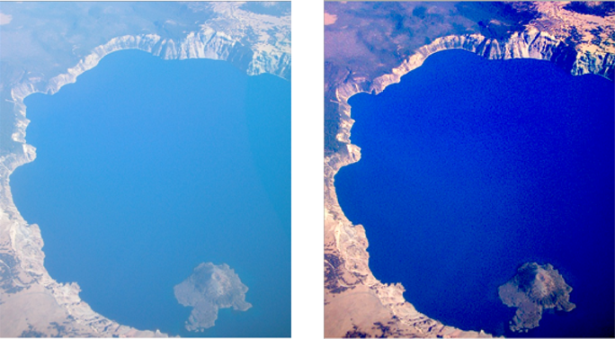

# 创建自定义滤镜

如果Core Image提供的滤镜不能满足需求的话，可以自定义滤镜。可以将滤镜作为应用程序项目的一部分，或者（仅在MacOS中）可以将一个或多个滤镜作为独立图像单元打包。 图像单元使用NSBundle类，并允许应用程序托管外部插件滤镜。

自定义滤镜和图像单元：

## Core Image中的图像处理操作

Core Image的工作原理是把输出像素反映射会属入像素的计算方式写为内核（即，每个像素计算方式）。这种方式可以实现大多数的图像处理操作，但有时不行。在编写滤镜之前，需要考虑是否可以在Core Image中表示图像处理操作。例如，计算直方图很难被描述为与源图像的反映射。

## 创建自定义滤镜

写一个CPU可执行的滤镜。Core Image 提供了三种基于内核的滤镜：颜色滤镜，形变滤镜，常规滤镜。常规滤镜包含修改像素颜色和位置的GPU内核代码。如果你想设计一个只修改像素颜色或者图片的几何结构，而不修改像素，可以创建一个颜色或者形变滤镜来使Core Image提供跨硬件的更好的性能，详细的内容可以看[CIColorKernel](https://developer.apple.com/reference/coreimage/cicolorkernel)
和[CIWarpKernel](https://developer.apple.com/reference/coreimage/ciwarpkernel)两个类。

本节假设常规滤镜的region of interest(ROI)和domain of definition一致。写一个自定义滤镜要确保已经理解了CoreImage的坐标系。

自定义CPU可执行滤镜，分为以下几步：
1. 写内核代码
2. 使用Quartz Composer测试内核代码
3. 声明滤镜的接口
4. 给CIKernel对象创建初始化方法
5. 自定义属性方法
6. output Image 方法
7. 注册滤镜
8. 写创建滤镜实例的方法

下面写一个示例，去除图片中的雾霾模糊，通过调整图片的亮度和对比度，并进行锐化。


### 1. 写内核代码

每个像素执行的处理操作代码保存在```.cikernel```文件中，里面可以写多个内核处理程序代码。使用OpenGL着色语言（glslang）的子集和Core Image扩展来指定内核。

内核代码必须返回一个包含源像素映射到目标像素的结果的向量（vec4）。CoreImage为每个像素调用内核程序一次。在编写代码时，一个很好的策略是尽可能多地从实际的内核中进行不变的计算，并将其放在Objective-C滤镜部分。

雾霾去除滤镜的内核代码：
```
kernel vec4 myHazeRemovalKernel(sampler src,             // 1
                     __color color,
                    float distance,
                    float slope)
{
    vec4   t;
    float  d;

    d = destCoord().y * slope  +  distance;              // 2
    t = unpremultiply(sample(src, samplerCoord(src)));   // 3
    t = (t - d*color) / (1.0-d);                         // 4

    return premultiply(t);                               // 5
}
```
1. 输入四个参数，输出一个向量。内核程序输出一个vec4类型的数据。
2. 根据目标坐标的y值和斜率和距离输入参数计算一个值。```destCoord```（由CoreImage提供）方法返回当前正在计算的像素的工作空间坐标中的位置。
3. 
