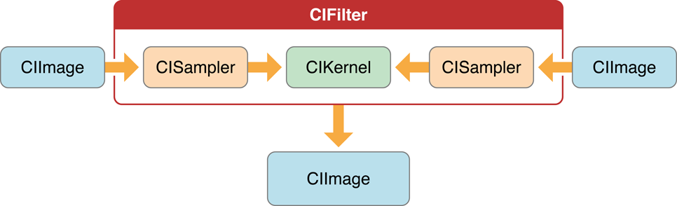

# 自定义滤镜之前要知道的东西

Core Image支持自定义滤镜。自定义滤镜其实就是像素进行怎样的运算。

## 滤镜clients和滤镜Creators

Core Image是为两种开发人员设计的：clients（外部调用）和Creators（内部实现）。

滤镜的核心是内核，内核就是定义了源图像的像素进行的运算，有简单的有复杂的。

滤镜通过OpenGL Shading Language（glslang）的变体语言指定像素计算。内核对于clients是不可见的，一个滤镜内部可以使用多个处理操作，通过一个操作的返回值作为另一个操作的参数。

**注意：**内核是用Core Image的变体glslang编写的一个处理像素的实际程序。```CIKernel```是一个包含内核程序的的Core Image的对象。创建一个filter，会自动生成一个```.cikernel```后缀的文件。通过传递包含内核程序的字符串，创建CIKernel对象。

滤镜Creators可以通过使用NSBundle类指定的架构将滤镜打包成插件或图像单元，使其可用于任何应用程序。图像单元可能包含多个滤镜。

滤镜clients可以使用Core Image的API去加载图像单元，或者获取图像单元中的滤镜列表。

## 处理链

有的滤镜可能需要多个```input image```，有的可能一个也不需要。但是一般都会需要创建一个```out putImage```。

**注意：**尽管CIImage对象有所有与图片相关的的数据，但它并不是一个图片，它有生成一张图片的所有必要的信息，但是Core Image并不会实际的去渲染一个图片直到手动渲染。



```CISampler```对象是一个采样器，从源图中检索像素，并提供给内核。滤镜creater会为每个源图像提供采样器。

采样器定义：

* 坐标转换，如果不需要坐标转换的话可以是identity。
* 插值模式，邻近采样或者双线性插值（默认）。
* 包装模式，指定当采样区超出源图像之后如果产生像素，-透明黑色；-```clamp to the extent```(夹在一定范围内：通过复制范围边界的像素？？？)

滤镜creator在内核中定义每一个像素执行的计算，但是Core Image实际处理这些计算的实现。Core Image决定这些处理是由GPU还是CPU来处理。Core Image根据设备使用Metal、OpenGL或者OpenGL ES来实现硬件光栅化。
---
```It implements software rasterization through an emulation environment specifically tuned for evaluating fragment programs with nonprojective texture lookups over large quadrilaterals (quads).```**(没看懂)**
---

像素处理路径是从源图像到目标图像，但是Core Image的处理路径是从目的开始返回到源像素。这种倒退的方式可以最小化实际需要计算的像素数量。

CoreImage通过其他方式来促进高效处理。智能缓存和编译器优化来使其适合实时视频处理和图像分析等任务，它缓存重复计算任何数据集的中间结果，重复使用的对象会保留到缓存中。我们并不需要知道缓存的具体实现，但可以通过重用对象（图像、上下文等）来获取最佳性能。

CoreImaget通过在内核和```pass levels```(**啥意思**)使用传统的编译技术获取高性能，CoreImage用于分配寄存器的方法可以最小化临时寄存器和像素缓冲区的数量。

## 坐标空间

Core Image在与设备无关的工作空间中执行操作，CoreImage的工作空间在理论上是无限的。

当Core Image读取图像时，它会将像素位置转换为与设备无关的工作空间坐标。当显示处理后的图像时，Core Image将空间坐标转换为目的（如显示）的相应坐标。

当自定义filter时，需要熟悉两个坐标系：
* 目标坐标系：图片渲染目标坐标系。通过```destCoord函数```获取当前位置。
* 采样坐标系：正在纹理的坐标系。通过```samplerCoord函数```获取当前位置。

请记住，如果源数据是平铺的，则采样器坐标有一个偏移量（dx,dy）。如果采样坐标有偏移量，就必须要用```samplerTransform函数```将坐标从样本坐标转换为目标坐标。

## The Region of Interest(感兴趣区域)

滤镜creator需要知道的感兴趣区域和定义域的关系。

* 感兴趣区域：源图像的区域
* 定义域：采样器提供给内核去计算的源图像上的区域（例如，两个图像只融合图像的一半）。

定义域描述了滤镜的形状边界，理论上这个形状可以是无限的， 例如，可以创建一个重复无限延伸的滤镜。

ROI和定义域可以通过以下方式相互关联：

* 使坐标系成比例。例如1：1，从源坐标对应到目标坐标。
* 互相依赖，但以某种方式进行调节。例如，模糊滤镜，需要使用源坐标点及其附近的像素，产生目标坐标系中的一个像素。
* 定义域由采样器提供的查找表中的值计算。map或table中值的位置与源图像和目的的工作空间坐标无关。图像坐标的值不需要是定义域（提供给内核计算的区域）中的坐标值。

默认情况下，CoreImage是假设定义域和ROI区域是一致的。如果你的自定义滤镜中不支持这个假设，需要提供ROI的计算方式。

## 可执行和不可执行滤镜

## 颜色分量和预乘alpha

预乘alpha是用于描述源颜色的术语，其颜色已经乘以alpha值。通过消除对每个颜色分量执行乘法运算的需要，加速了图像的渲染。例如，在RGB颜色空间，渲染预乘alpha的图像，避免了图像中每个颜色的三次乘法运算（red\*alpha，green\*alpha,blue*alpha）。

滤镜creators必须给CoreImage提供预乘alpha值的颜色分量，否则，滤镜会将alpha的值当为1.0进行预乘。确保颜色分量预分配对于操纵颜色的滤镜很重要。

默认情况下，Core Image假定处理节点是每像素128位，线性光，使用GenericRGB颜色空间的预乘RGBA浮点值。可以通过设置Quartz 2D CGColorSpace对象来指定一个不同的颜色空间，**注意**颜色空间必须是基于RGB的，如果使用其他颜色空间（例如YUV），那么需要使用ColorSync进行颜色空间的转换。

源颜色为8位的YUV 4：2：2，Core Image每GB可以处理240个HD层， 8位YUV是DV，MPEG，未压缩D1和JPEG等视频源的本机颜色格式。需要将YUV的颜色空间转换为Core Image的RGB颜色空间。
