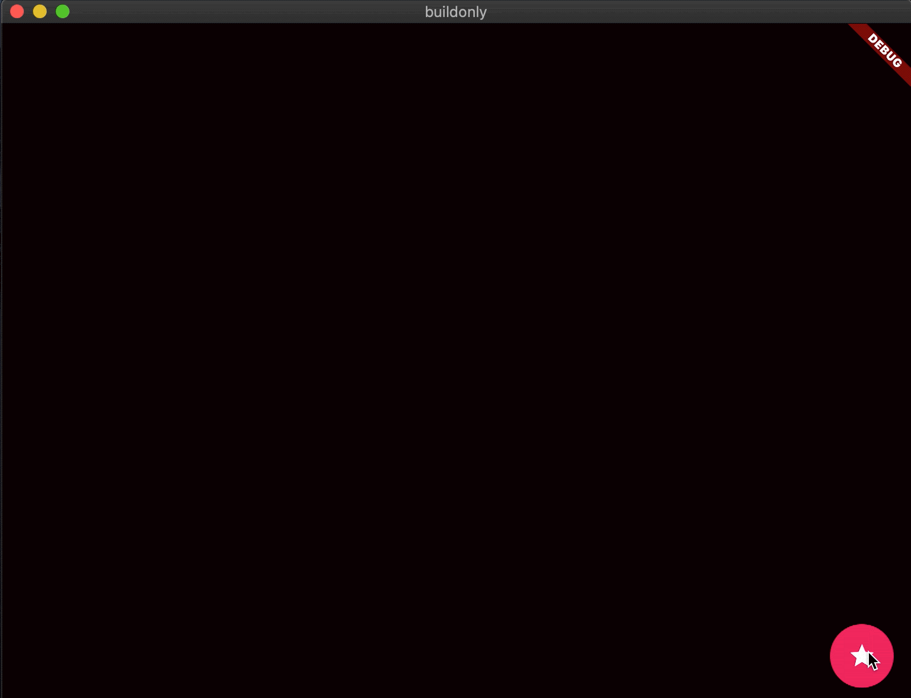
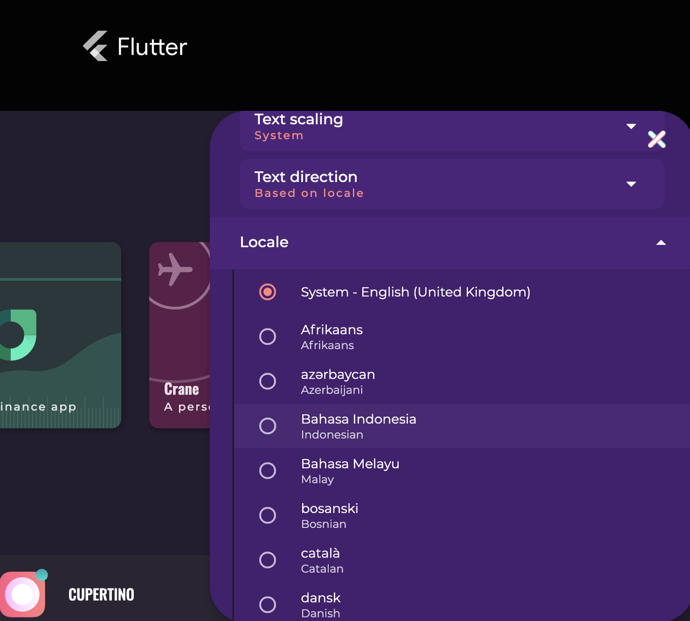

# [构建高性能的Flutter Widgets](https://medium.com/flutter/building-performant-flutter-widgets-3b2558aa08fa?source=collection_home---4------7-----------------------)

翻译：

所有的Stateless和stateful Widgets 都是在 `build()`方法中定义是如何渲染的。应用中的一屏可能包含上百甚至上千个Widget，这些widget可能会构建一次，如果有动画或某种互动，也会构建多次。虽然flutter构建Widget的速度相对较快，但是仍需要注意构建的时间和内容。


本文介绍仅在需要时构建所需的内容。我们分享如何使用这种方法在Flutter Gallery Web应用程序中实现显着的性能改进。我们还将分享一些专业技巧，教你如何诊断web应用中的类似问题。


# Only build when necessary

一个重要的优化是仅在绝对必要是才构建widget。

### 谨慎调用`setState()`

调用`setState()`方法可以重新调用`build()`方法，频繁调用会降低屏幕性能。

考虑以下动画，其中显示在前面的（黑屏）的显示动画向下滑动以露出后面板（棋盘），类似于bottom sheet。 前面的widget很简单，但是后面的widget很忙：



代码如下：

```dart
Stack(
   children: [
     Back(),
     PositionedTransition(
       rect: RelativeRectTween(
         begin: RelativeRect.fromLTRB(0, 0, 0, 0),
         end: RelativeRect.fromLTRB(0, MediaQuery.of(context).size.height, 0, 0),
       ).animate(_animationController),
       child: Front(),
     )
   ],
 ),
```


下面错误的使用：

```dart
// BAD CODE
@override
void initState() {
 super.initState();
 _animationController = AnimationController(
   duration: Duration(seconds: 3),
   vsync: this,
 );
 _animationController.addListener(() {
   setState(() {
     // Rebuild when animation ticks.
   });
 });
}
```

这是耗性能的，因为动画在做不必要的工作。


有问题的代码如下：

```dart
// BAD CODE
_animationController.addListener(() {
 setState(() {
   // Rebuild when animation ticks.
 });
});
```

* 当您需要为整个小部件制作动画时，建议使用这种动画风格，但不是这里。
* 在动画中监听调用`setState()`会导致整个`Stack` 重新构建，这是不必要的。
* PositionedTransition 已经是一个 AnimatedWidget，所以他会在动画计时时自动重新构建。
*  `setState()`是真的不需要再这里调用


即使back widget很忙，他仍然能以60帧/s的速度流畅的运行。有关如何正确的调用 `setState()` 的更多信息参见 [Flutter 延迟动画：为什么不调用setStete](https://medium.com/flutter-community/flutter-laggy-animations-how-not-to-setstate-f2dd9873b8fc)


# Only build *what* is necessary

除了仅在需要时进行构建外，还希望仅构建用户界面中实际更改的部分。 以下部分重点介绍创建高性能列表。

### Prefer ListView.builder()

首先介绍下显示列表的基础知识

1. 垂直布局使用 `Column`
2. 如果需要滚动，使用`ListView`
3. 如果包含很多item，使用`ListView.builder` 构造方法，在屏幕滚动时创建，而不是直接创建所有的widget。对于复杂的列表项和较深的widget tree，有显著的性能优势。


看几个例子：


在 【exapmle in Dart】上运行以下代码（点击 运行，输出窗口没有滚动条，但是可以滚动内容并观察控制台，查看何时构建了什么内容）

```dart
ListView(
  children: [
    _ListItem(index: 0),
    _ListItem(index: 1),
    _ListItem(index: 2),
    _ListItem(index: 3),
    _ListItem(index: 4),
    _ListItem(index: 5),
    _ListItem(index: 6),
    _ListItem(index: 7),
  ],
);
```

下一步，运行`ListView.builder` ，注意，只创建了可见的项。在滚动时才创建新的rows。

```dart
ListView.builder(
  itemBuilder: (context, index) {
    return _ListItem(index: index);
  },
  itemCount: 8,
);
```

现在，在DartPad中运行这个例子，ListView的子节点是在ListView本身被创建的时候被一次性创建的。在这个场景中，使用ListView构造函数更有效。

```dart
final listItems = [
  _ListItem(index: 0),
  _ListItem(index: 1),
  _ListItem(index: 2),
  _ListItem(index: 3),
  _ListItem(index: 4),
  _ListItem(index: 5),
  _ListItem(index: 6),
  _ListItem(index: 7),
];
@override
Widget build(BuildContext context) {
  // This offers no benefit, it is actually more efficient to use the ListView constructor instead.
  return ListView.builder(
    itemBuilder: (context, index) {
      return listItems[index];
    },
    itemCount: 8,
  );
}
```

更多懒加载列表，查看 [Slivers,Demystified](https://medium.com/flutter/slivers-demystified-6ff68ab0296f)。


### 如何用一行代码将Flutter Gallery的网页渲染时间提高了两倍以上

Flutter Gallery 支持超过100中语言环境；使用 `ListView.builder` 列出这些语言环境。通过获取Widget rebuild的信息，我们注意到这些列表项在启动时是不必要构建的。这些项目不是罪魁祸首，因为她们处于二级的折叠菜单里：设置页和区域设置项的扩展模块（事实证明，使用ScaleTransition将设置面板渲染为“不可见”，这意味着 被大量建造）。



通过简单地将未扩展设置类别的ListView.builder的itemCount设置为0，我们确保列表项仅针对已扩展的可见类别构建。 解决此问题的 [单行PR](https://github.com/flutter/gallery/pull/109/files) 将Web上的渲染时间缩短了2倍以上。 关键是要识别过多的widget 构建。

### 查看应用的 widget 的构建计数

尽管Flutter的构建非常有效，但是在某些情况下，过度构建可能会导致性能问题。 有几种方法可以识别过度的widget重建。

#### 使用 Android Studio/Intellij 的内建工具 

[显示widget rebuild 信息](https://flutter.dev/docs/development/tools/android-studio#show-performance-data)

#### 修改framework

如果您使用其他编辑器，或者想了解Web的小部件重建信息，则可以通过在框架中添加一些代码来实现。示例输出：

```
RaisedButton 1
RawMaterialButton 2
ExpensiveWidget 538
Header 5
```

在 `<Flutter path>/packages/flutter/lib/src/widgets/framework.dart` 中

添加以下代码，该代码计算启动时构建小部件的次数，并在一段时间（此处为10秒）后输出结果。

```
bool _outputScheduled = false;
Map<String, int> _outputMap = <String, int>{};
void _output(Widget widget) { 
  final String typeName = widget.runtimeType.toString();
  if (_outputMap.containsKey(typeName)) {
    _outputMap[typeName] = _outputMap[typeName] + 1;
  } else {
    _outputMap[typeName] = 1;
  }
  if (_outputScheduled) {
    return;
  }
  _outputScheduled = true;
  Timer(const Duration(seconds: 10), () {
    _outputMap.forEach((String key, int value) {
      switch (widget.runtimeType.toString()) {
        // Filter out widgets whose build counts we don't care about
        case 'InkWell':
        case 'RawGestureDetector':
        case 'FocusScope':
          break;
        default:
          print('$key $value');
      }
    });
  });
}
```

然后修改 StatelessElement 和 StatefulElement  `build` 方法去调用 `_output(widget)`。

```dart
class StatelessElement extends ComponentElement {
  ...
@override
  Widget build() {
    final Widget w = widget.build(this);
    _output(w);
    return w;
   }
class StatefulElement extends ComponentElement {
...
@override
  Widget build() {
    final Widget w = _state.build(this);
    _output(w);
    return w;
  }
```

[修改后的framework.dart](https://gist.github.com/guidezpl/54f9a03b0adbf207153178dba0bf214c)

请注意，大量重建并不一定表示有问题。 但是，例如，它可以通过验证未构建不可见的widget来帮助调试性能问题。

仅适用于网络的提示：您可以添加resetOutput函数（可以从浏览器的开发者工具调用），以便在任何时间点获取widget的构建计数。

```dart
import 'dart:js' as js;
 
void resetOutput() {
 _outputScheduled = false;
 _outputMap = <String, int>{};
}
void _output(Widget widget) {
  // Add this line
  js.context['resetOutput'] = resetOutput;
  ...
```

最终的 [framework.dart](https://gist.github.com/guidezpl/32518a6d22596393fa368c28e8f0ece4)


### 结语

要进行有效的性能调试，您需要了解幕后情况。 这些技巧可以帮助您决定如何实施下一个构建方法，以使您的应用在所有情况下均保持高性能。

这篇文章是关于我们在提高Flutter Gallery性能时所学知识的系列文章的一部分。 创建高性能Flutter Web应用程序系列中的文章：

[Optimizing performance in Flutter web apps with tree shaking and deferred loading](https://medium.com/flutter/optimizing-performance-in-flutter-web-apps-with-tree-shaking-and-deferred-loading-535fbe3cd674)

[Improving perceived performance with image placeholders, precaching, and disabled navigation transitions](https://medium.com/flutter/improving-perceived-performance-with-image-placeholders-precaching-and-disabled-navigation-6b3601087a2b)


