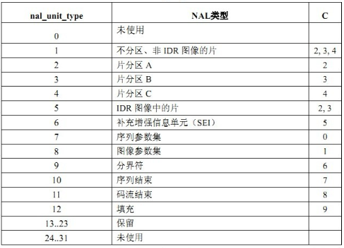

# VideoToolBox硬编码，硬解码

###VideoToolBox硬编码（h264）

H264编码分为两层:

* 视频编码层（VCL：Video Coding Layer）负责高效的视频内容表示
* 网络提取层（NAL：Network Abstraction Layer）负责以网络所要求的恰当的方式对数据进行打包和传送(根据不同的网络把数据打包成相应的格式，将VCL产生的比特字符串适配到各种各样的网络和多元环境中)

**NALU：NAL unit,NAL单元**

I帧、P帧、B帧都是被封装成一个或者多个NALU进行传输或者存储的，I帧开始之前也有非VCL的NAL单元，用于保存其他信息，比如：PPS、SPS

* PPS（Picture Parameter Sets）：图像参数集
* SPS（Sequence Parameter Set）：序列参数集

>在H264数据帧中，每个NALU中间通过startCode进行分隔，如果NALU对应的Slice为一帧的开始就用0x00000001，否则就用0x000001。一般来说编码器编出的首帧数据为PPS与SPS，接着为I帧，后续是B帧、P帧等数据。


**GOP**:Group of picture图像组，一组中包含一个i帧多个bp帧，每个IDR帧都是i帧，IDR是i帧的一个子集，IDR帧带有控制逻辑，当解码器解码到 IDR（立即刷新图像）图像时，立即将参考帧队列清空，将已解码的数据全部输出或抛弃，重新查找参数集，开始一个新的序列。这样，如果前一个序列出现重大错误，在这里可以获得重新同步的机会。IDR图像之后的图像永远不会使用IDR之前的图像数据进行解码。

**H.264编码流程：**

1. 初始化文件写入对象（NSFileHandle），设置文件存储路径.
2. 初始化压缩会话（VTCompressionSessionRef），设置视频的压缩转换格式（h.264），帧率、码率，帧间隔等转换信息（配置转换器），以及压缩完成回调方法（VTCompressionOutputCallback）。
3. 通过摄像头采集画面，通过 ```- (void)captureOutput:(AVCaptureOutput *)captureOutput didOutputSampleBuffer:(CMSampleBufferRef)sampleBuffer fromConnection:(AVCaptureConnection *)connection``` 方法传回sampleBuffer，sampleBuffer中存放了视频画面信息。
4. 将视频信息传给压缩session，按照h.264格式的压缩算法进行压缩，转换后为h.264格式的视频数据，通过session初始化传入的回调方法输出压缩后的h.264格式的sampleBuffer。
5. 获取到转换后的sampleBuffer，按照h.264的编码格式进行编码写入文件。

>1. 判断是否是关键帧，在关键帧前面添加sps和pps数据。
>2. 编码图像数据区域：此时NALU的前四个字节存放的不是startCode，而是当前的帧长度。通过指针偏移读取NALU的数据信息，并持续写入文件。

**关键帧**

* 判断是否为关键帧（一个新的GOP）,i帧前存放sps和pps（写入sps和pps时要在前面添加‘00 00 00 01’分隔）。
* 图像数据区域（i,b,p）是被封装成一个个NAL Unit。但是前面通过h.264压缩算法后传回的sampleBuffer，每一帧钱存放的不是‘00 00 00 01’，所以需要跳过读取，需要在每一帧前添加‘00 00 00 01’，然后写入文件。

**VideoToolBox硬解码（h264）:**

1. 读取数据到buffer中，通过startCode“00 00 00 01”定位起始位置

，继续移动指针查找到下一个startCode，来确定当前数据集合的长度，并拷贝数据信息。

2. 解析获取的数据信息，startCode之后的第一个字节保存的是NALU的类型信息。将其转为二进制后：
>第1位：值为1，表示语法出错。
>第2~3位：参考级别。
>第4~8位：NALU类型。
3. 通过上一步解析出来的sps和pps的信息，创建视频描述CMFormatDescriptionRef，再根据CMFormatDescriptionRef创建生成解码会话VTDecompressionSessionRef。
4. 读取到视频数据信息后，进行解码。创建CMBlockBufferRef（存放视频图像数据），使用解码会话进行解码，获取解码后的信息存放到CVPixelBufferRef中，通过系统的AVSampleBufferDisplayLayer预览，或者生成图像，通过imageView显示，或者使用OpenGL显示。

NALU类型如下图：

```
typedef enum {
    NALU_TYPE_SLICE    = 1,
    NALU_TYPE_DPA      = 2,
    NALU_TYPE_DPB      = 3,
    NALU_TYPE_DPC      = 4,
    NALU_TYPE_IDR      = 5,
    NALU_TYPE_SEI      = 6,
    NALU_TYPE_SPS      = 7,
    NALU_TYPE_PPS      = 8,
    NALU_TYPE_AUD      = 9,
    NALU_TYPE_EOSEQ    = 10,
    NALU_TYPE_EOSTREAM = 11,
    NALU_TYPE_FILL     = 12,
} NaluType;
```
