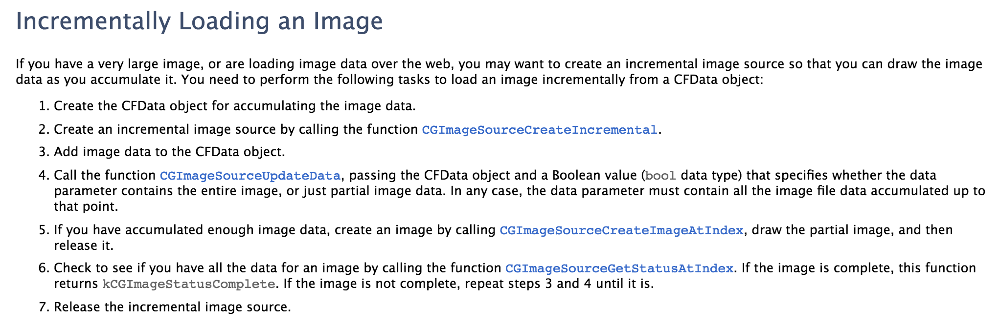

### 渐进式图片下载:   
渐进图片显示和图片的存储方式有关（Baseline JPEG和Progressive JPEG）。通常BMP图像文件的结构为：
【【位图文件头】【位图信息头】【调色板】【位图数据】】[位图结构](http://wenku.baidu.com/view/4e84dad4195f312b3169a59f.html?re=view)  
渐进显示思路：  
1、首先通过CGImageSourceCreateIncremental创建一个空的imageSourc。  
2、然后每次获取到新的数据后使用CGImageSourceUpdateData方法进行生成图片，再去显示。  
但实现时总是在图片快要加载完成时，才会显示图片，图片有渐变清晰的效果，也有最下部分逐步变完整的效果。   
   
当累积足够的image data时，去创建图片。所以可能出现上面问题的原因是图片的数据不够。。。
