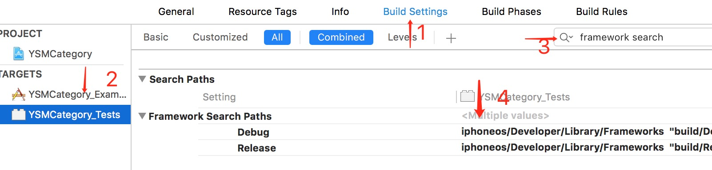

#<center>问题</center>
- 问题描述：找不到framework库，原因是Xcode的framework库文件换位置了。
```
ld: warning: directory not found for option '-F/Applications/Xcode.app/Contents/Developer/Platforms/iPhoneSimulator.platform/Developer/SDKs/iPhoneSimulator10.2.sdk/Developer/Library/Frameworks'
```
   
解决方法：查找到对应的target->Build Settings->Search Paths->Framework search Paths. 替换成```$(PLATFORM_DIR)/Developer/Library/Frameworks```。

