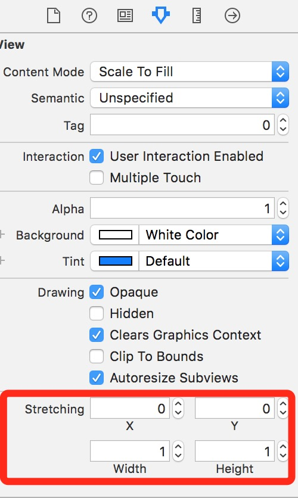
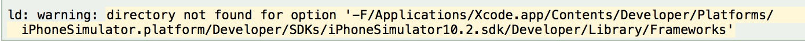
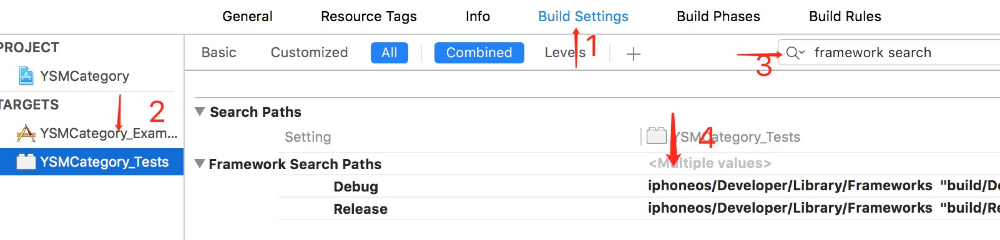

# Tips

##### 1、NSNumberFormatter
在计算View的frame时，我们通常设置的是自适应，“sizeToFit”,或者是一些通过计算出来的frame，但是实际效果总是跟我们设置的值有些偏差，在经过测试分析后的发现系统在最后确定frame时，会进行舍入，并总是保留一位小数：当“.”后的值小于0.5时，会入成0.5；当等于0.5，会保持不变；当大于0.5，会入成1.0。

```
CGFloat frameFormatterNumber(CGFloat number){
    NSNumberFormatter * formatter = [[NSNumberFormatter alloc] init];
    //允许1位小数
    formatter.maximumFractionDigits = 1;
    //增量设置为0.5
    formatter.roundingIncrement = @0.5;
    //向上取整
    formatter.roundingMode = kCFNumberFormatterRoundUp;
    return [[formatter stringFromNumber:[NSNumber numberWithFloat:number]] floatValue];
}
```
当我们根据label中的文字,通过```- (CGRect)boundingRectWithSize:(CGSize)size options:(NSStringDrawingOptions)options attributes:(nullable NSDictionary<NSString *, id> *)attributes context:(nullable NSStringDrawingContext *)context```方法计算完之后在转换，获得准确的label的frame。

---
#####  2、frame和bounds
frame是相对于父视图，bounds是相对于子视图的。

scrollView和其子类，在滚动的时候，size是不变的，但是origin是会发生改变的，向左滑动，origin.x是增加的；向上滑动origin.y是增加的。当初始状态下origin为（0，0），如果向上滑动的了，然后想在屏幕上原来（0,0）的位置添加一个view的话，这时的y值是大于0的。

---
#####  3、UISearchBar
UISearchBar貌似默认是没有回收时的动画的，最后加了一个动画，让它取消第一响应。。。。

 ---
#####  4、UITabBarController
当重写navigationController的方法```pushViewController(_ viewController: UIViewController, animated: Bool)```时，如果我们用到tabbarController的话，一般会在这里统一设置hidesBottomBarWhenPushed属性为true，当push的时候隐藏掉tabbar。

```
override func pushViewController(_ viewController: UIViewController, animated: Bool) {
        viewController.hidesBottomBarWhenPushed = true
        super.pushViewController(viewController, animated: animated)
}
```
但是这是有问题的,刚启动就找不到tabbar了，设置rootViewController的时候也会走这个方法，导致第进来之后就直接隐藏掉tabbar了```public init(rootViewController: UIViewController) // Convenience method pushes the root view controller without animation.```

---
##### 5、图片的解压缩
从磁盘中加载一张图片，并将它显示到屏幕上，中间的主要工作流如下：

1. 假设我们使用 +imageWithContentsOfFile: 方法从磁盘中加载一张图片，这个时候的图片并没有解压缩；
2. 然后将生成的 UIImage 赋值给 UIImageView；
3. 接着一个隐式的 CATransaction 捕获到了 UIImageView 图层树的变化；
4. 在主线程的下一个 run loop 到来时，Core Animation 提交了这个隐式的 transaction ，这个过程可能会对图片进行 copy 操作，而受图片是否字节对齐等因素的影响，这个 copy 操作可能会涉及以下部分或全部步骤：

> 1. 分配内存缓冲区用于管理文件 IO 和解压缩操作；
> * 将文件数据从磁盘读到内存中；
> * 将压缩的图片数据解码成未压缩的位图形式，这是一个非常耗时的 CPU 操作；
> * 最后 Core Animation 使用未压缩的位图数据渲染 UIImageView 的图层。

图片的解压缩是一个非常耗时的 CPU 操作，并且它默认是在主线程中执行的。那么当需要加载的图片比较多时，就会对我们应用的响应性造成严重的影响，尤其是在快速滑动的列表上，这个问题会表现得更加突出。

位图就是一个像素数组，数组中的每个像素就代表着图片中的一个点。在将磁盘中的图片渲染到屏幕之前，必须先要得到图片的原始像素数据，才能执行后续的绘制操作，这就是为什么需要对图片解压缩的原因。

**强制解压缩**
图片的解压缩是不可避免的，当未解压缩的图片将要渲染到屏幕时，系统会在主线程对图片进行解压缩，而如果图片已经解压缩了，系统就不会再对图片进行解压缩。为了不让解压缩在主线程执行影响性能，可以在手动在子线程提前进行强制解压缩，强制解压缩的原理就是对图片进行重新绘制，得到一张新的解压缩后的位图。

---
##### 6、drawRect调用
drawRect调用的前提：

* view第一次被加载到屏幕上
* 顶部的其他视图移动
* view的hidden属性被改变
* 手动调用了setNeedsDisplay()或者setNeedsDisplayInRect()方法

**注意**: drawRect(\_:)方法中的所有绘制都会进入视图的上下文，如果在drawRect(\_:)外部进行绘制，必须创建自己的上下文。
永远不要直接调用drawRect(\_:)方法，如果想更新视图，调用setNeedsDisplay()，它会将view进行标记，当下一次屏幕更新周期触发drawRect(_:)时重绘。

---
##### 7、Category属性问题
不能再分类中给已有类添加存储属性，可以添加计算属性（UIView的left，right）。分类中的属性只会创建setter和getter方法，不会生成实例变量，所以在setter和getter方法中无法赋值。

---
##### 8、循环引用
1. A强引用B，B抢引用A。
2. A有个属性为block，在block中又调用A（A在进入block中时，block会强引用A）。
3. 在viewcontroller中使用timer，在dealloc中释放timer，只要timer活跃，就不会进入到dealloc。需要在viewDidDisapper中释放timer。

---
##### 9、深拷贝与浅拷贝
集合对象copy：

* 不可变对象是浅拷贝
* 可变对象是深拷贝

集合对象mutableCopy：深拷贝

非集合对象copy：

* 不可变对象是浅拷贝
* 可变对象是深拷贝

非集合对象mutableCopy:深拷贝

* [immutableObject copy] 浅拷贝
* [mutableObject copy] 深拷贝
* [object mutableCopy] 深拷贝

---
##### 10、视频直播秒开
1. 改写播放器逻辑，让播放器拿到第一个关键帧后就给予显示。
GOP的第一帧通常是关键帧，直播服务器支持GOP缓存，播放器在和服务器简历连接后可以立即拿到关键帧。减少关键帧的距离，是可以改善画质，让播放器快速拿到关键帧，但同时增加了宽带和网络的负载，如果网络不佳，不能快速下载到GOP，会影响体验。
2. 提前做好DNS解析，和做好测速选线（择取最有线路）。
3. 缓存，缓存最近的一个关键帧。

---
##### 11、图片拉伸的几种方式
1. 通过UIImage的方法```- (UIImage *)resizableImageWithCapInsets:(UIEdgeInsets)capInsets resizingMode:(UIImageResizingMode)resizingMode```来设置图片的可拉伸区域。
2. 如果是通过Assets添加的图片，则可以在Assets.xcassets中需要设置拉伸的图片，点击右下角的**Show Slicing**，在页面中可视化的去拖动拉伸的区域。
3. CALyaer有个contentsCenter的属性，这是一个CGRect，定义了一个固定的边框和一个在图层上可拉伸的区域，值是0.0-1.0。在Interface Builder中为Stretching属性。


---
##### 12、+load()与+initialize()方法
**调用时机**

* +load()方法：官方文档介绍:Invoked whenever a class or category is added to the Objective-C runtime;，意思是说当类被加载到runtime的时候就会运行，也就是说是在main.m之前~会根据Compile Sources中的顺序来加载，但还有一个需注意的加载顺序。
* +initialize()方法：官方文档上介绍:Initializes the class before it receives its first message.意思是在类接收第一条消息之前初始化类。值得注意的点是：类初始化的时候每个类只会调用一次+initialize()，如果子类没有实现+initialize()，那么将会调用父类的+initialize()，也就是意味着父类的+initialize()可能会被多次调用。

**使用场景：**

* +load():通常用来进行Method Swizzle，尽量避免过于复杂以及不必要的代码。
* +initialize():一般用于初始化全局变量或静态变量。

---

##### 13、约束布局优先级

当两个控件并排的时候，如果需要优先满足其中之一，可以通过设置约束的优先级来控制。有两个方法：

“Content Compression Resistance Priority”，也叫内容压缩阻力优先级，该优先级越高，则越晚轮到被压缩。

“Content Hugging Priority”，也叫内容紧靠优先级，该优先级越高，这越晚轮到被拉伸。

---

##### 14、滚动时回收键盘

当ScrollView滚动时将键盘回收，通过设置UIScrollViewKeyboardDismissMode属性设置。

```
typedef NS_ENUM(NSInteger, UIScrollViewKeyboardDismissMode) {
    UIScrollViewKeyboardDismissModeNone,
    UIScrollViewKeyboardDismissModeOnDrag,      // dismisses the keyboard when a drag begins
    UIScrollViewKeyboardDismissModeInteractive, // the keyboard follows the dragging touch off screen, and may be pulled upward again to cancel the dismiss
} NS_ENUM_AVAILABLE_IOS(7_0);
```

---

##### 15、设置UIView的透明度，影响subView的透明度

解决方案：设置background color的颜色中的透明度。

---

##### 16、在工程中查看是否使用 IDFA

打开终端，到工程目录中， 输入：

grep -r advertisingIdentifier .

可以看到那些文件中用到了IDFA，如果用到了就会被显示出来。

---

##### 17、获取手机已安装的应用
```
Class c =NSClassFromString(@"LSApplicationWorkspace");
id s = [(id)c performSelector:NSSelectorFromString(@"defaultWorkspace")];
NSArray *array = [s performSelector:NSSelectorFromString(@"allInstalledApplications")];
for (id item in array){
    NSLog(@"%@",[item performSelector:NSSelectorFromString(@"applicationIdentifier")]);
    //NSLog(@"%@",[item performSelector:NSSelectorFromString(@"bundleIdentifier")]);
    NSLog(@"%@",[item performSelector:NSSelectorFromString(@"bundleVersion")]);
    NSLog(@"%@",[item performSelector:NSSelectorFromString(@"shortVersionString")]);
}
```

---

##### 18、判断两个日期是否在同一周 写在NSDate的category里面
```
- (BOOL)isSameDateWithDate:(NSDate *)date{
    //日期间隔大于七天之间返回NO
    if (fabs([self timeIntervalSinceDate:date]) >= 7 * 24 *3600){
        return NO;
    }

    NSCalendar *calender = [NSCalendar currentCalendar];
    calender.firstWeekday = 2;//设置每周第一天从周一开始
    //计算两个日期分别为这年第几周
    NSUInteger countSelf = [calender ordinalityOfUnit:NSCalendarUnitWeekday inUnit:NSCalendarUnitYear forDate:self];
    NSUInteger countDate = [calender ordinalityOfUnit:NSCalendarUnitWeekday inUnit:NSCalendarUnitYear forDate:date];

    //相等就在同一周，不相等就不在同一周
    return countSelf == countDate;
}
```

---

##### 19、数字格式化输出
```
//通过NSNumberFormatter，同样可以设置NSNumber输出的格式。例如如下代码：
NSNumberFormatter *formatter = [[NSNumberFormatter alloc] init];
formatter.numberStyle = NSNumberFormatterDecimalStyle;
NSString *string = [formatter stringFromNumber:[NSNumber numberWithInt:123456789]];
NSLog(@"Formatted number string:%@",string);
//输出结果为：[1223:403] Formatted number string:123,456,789

//其中NSNumberFormatter类有个属性numberStyle，它是一个枚举型，设置不同的值可以输出不同的数字格式。该枚举包括：
typedef NS_ENUM(NSUInteger, NSNumberFormatterStyle) {
    NSNumberFormatterNoStyle = kCFNumberFormatterNoStyle,
    NSNumberFormatterDecimalStyle = kCFNumberFormatterDecimalStyle,
    NSNumberFormatterCurrencyStyle = kCFNumberFormatterCurrencyStyle,
    NSNumberFormatterPercentStyle = kCFNumberFormatterPercentStyle,
    NSNumberFormatterScientificStyle = kCFNumberFormatterScientificStyle,
    NSNumberFormatterSpellOutStyle = kCFNumberFormatterSpellOutStyle
};
//各个枚举对应输出数字格式的效果如下：其中第三项和最后一项的输出会根据系统设置的语言区域的不同而不同。
[1243:403] Formatted number string:123456789
[1243:403] Formatted number string:123,456,789
[1243:403] Formatted number string:￥123,456,789.00
[1243:403] Formatted number string:-539,222,988%
[1243:403] Formatted number string:1.23456789E8
[1243:403] Formatted number string:一亿二千三百四十五万六千七百八十九
```

---

##### 20、navigationBar根据滑动距离的渐变色实现
```
- (void)scrollViewDidScroll:(UIScrollView *)scrollView{
    CGFloat offsetToShow = 200.0;//滑动多少就完全显示
    CGFloat alpha = 1 - (offsetToShow - scrollView.contentOffset.y) / offsetToShow;
    [[self.navigationController.navigationBar subviews] objectAtIndex:0].alpha = alpha;
}
```

---

##### 21、NSString进行URL编码和解码
```
NSString *string = @"http://abc.com?aaa=你好&bbb=tttee";

//编码 打印：http://abc.com?aaa=%E4%BD%A0%E5%A5%BD&bbb=tttee
string = [string stringByAddingPercentEncodingWithAllowedCharacters:[NSCharacterSet URLQueryAllowedCharacterSet]];

//解码 打印：http://abc.com?aaa=你好&bbb=tttee
string = [string stringByRemovingPercentEncoding];
```

---

##### 22、获取UIColor的RGBA值
```
UIColor *color = [UIColor colorWithRed:0.2 green:0.3 blue:0.9 alpha:1.0];
const CGFloat *components = CGColorGetComponents(color.CGColor);
NSLog(@"Red: %.1f", components[0]);
NSLog(@"Green: %.1f", components[1]);
NSLog(@"Blue: %.1f", components[2]);
NSLog(@"Alpha: %.1f", components[3]);
```

---

##### 23、swift字面量初始化

swift定义了以下协议，这些协议可以使一种类型通过字面量的方式来初始化并赋值。

```
NilLiteralConvertible
BooleanLiteralConvertible
IntegerLiteralConvertible
FloatLiteralConvertible
UnicodeScalarLiteralConvertible
ExtendedGraphemeClusterLiteralConvertible
StringLiteralConvertible
ArrayLiteralConvertible
DictionaryLiteralConvertible
```

---

##### 24、iOS系统自带悬浮调试框

在 AppDelegate 的 didFinishLaunchingWithOptions 方法中加入两行代码即可。

```
let overlayClass = NSClassFromString("UIDebuggingInformationOverlay") as? UIWindow.Type
_ = overlayClass?.perform(NSSelectorFromString("prepareDebuggingOverlay"))
```
运行程序后，两根手指点击状态栏即可调起这个调试的悬浮层。

[具体使用教程](http://swift.gg/2017/05/27/ui-debugging-information-overlay/)

---

##### 25、监听系统时间的三个通知

* **NSSystemTimeZoneDidChangeNotification：**监听修改时间界面的两个按钮状态变化
* **UIApplicationSignificantTimeChangeNotification：** 监听用户改变时间 （只要点击自动设置按钮就会调用）,新的一天开始或者时区变化。 
* **NSSystemClockDidChangeNotification：** 监听用户修改时间（时间不同才会调用）

---

##### 26、UITableView的headerView/footerView的高度问题

开发中如果要动态修改tableView的tableHeaderView或者tableFooterView的高度，需要给tableView重新设置，而不是直接更改高度。正确的做法是重新设置一下tableView.tableFooterView = 更改过高度的view。为什么？其实在iOS8以上直接改高度是没有问题的，在iOS8中出现了contentSize不准确的问题，这是解决办法。

---

##### 27、自定义聊天输入框弹出键盘修改frame

注册通知监听键盘将要改变的高度（UIKeyboardWillChangeFrame）。

保持输入框始终在键盘上方：

**初始状态**: inputTextView.top = kDeviceHeight-inputTextView.height-kNavBarHeight

**弹出状态**: inputTextView.top = kDeviceHeight-inputTextView.height-kNavBarHeight-keyBoardHeight

---

##### 28、找不到framework库

原因：Xcode的framework库文件换位置了。

```
ld: warning: directory not found for option '-F/Applications/Xcode.app/Contents/Developer/Platforms/iPhoneSimulator.platform/Developer/SDKs/iPhoneSimulator10.2.sdk/Developer/Library/Frameworks'
```

**解决方法**：查找到对应的target->Build Settings->Search Paths->Framework search Paths. 替换成```$(PLATFORM_DIR)/Developer/Library/Frameworks```。


---

##### 29、找不到CAMetalLayer

原因：需要连接真机。

--- 

##### 30、tableView报错：failed to obtain a cell from its dataSource

* xib的cell没有注册。 
* 内存中已经有这个cell的缓存了(也就是说通过你的cellId找到的cell并不是你想要的类型)，这时候需要改下cell的标识

---

##### 31、Other Linker Flags的作用

苹果官方Q&A的一段话：

> The "selector not recognized" runtime exception occurs due to an issue between the implementation of standard UNIX static libraries, the linker and the dynamic nature of Objective-C. Objective-C does not define linker symbols for each function (or method, in Objective-C) - instead, linker symbols are only generated for each class. If you extend a pre-existing class with categories, the linker does not know to associate the object code of the core class implementation and the category implementation. This prevents objects created in the resulting application from responding to a selector that is defined in the category.

OC 的链接器不会给**每个方法**都建立符号表，而只是为**类**建立符号表。

如果在静态库中为一个**已存在的类**定义了category，链接器就会认为类已经存在，而不会把category和核心类的代码结合起来。因此会导致最终的可执行文件中，缺少category的代码，最终导致方法调用失败。报错信息一般为： unrecognized selector to instance 0xXXXXXXXX.

Other Linker Flags 的三个参数：```-Objc```,```-all_load```,```-force_load```。

* ```-ObjC```: 链接器会将静态库中所有的Objective-C类和category都加载到可执行文件中，这样会因为加载了很多不必要的文件而导致可执行文件增大。
* ```-all_load```（**慎用**）: 链接器会把所有找到的目标文件都加载到可执行文件中。如果项目中不止一个静态库文件，然后又使用的本参数。因为不同的库文件中有可能存在相同的文件，所以有可能会遇到```ld: duplicate symbol```错误，因此在```-ObjC```失效的情况下使用```-force_load```.
* ```-force_load```: 与-all_load相同，只是在不同库存在相同文件的情况下，只是会加载一个文件，不影响其他文件的按需加载.