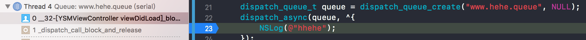

# Grand Central Dispatch

GCD 是异步执行任务的技术之一，提供系统级线程管理，具有高执行效率。开发者只需要将要执行的任务添加到适当的 Dispatch Queue 中，由系统自动调度执行。iOS6以后被纳入到 ARC 的范围内，不需要手动管理了。

> 通常应用程序中的线程管理要在系统层级实现，GCD是在iOS和OSX的核心XNU内核级上实现。

### Dispatch Queue

Dispatch Queue 通过**结构体和链表**实现为FIFO（First-In-First-out）队列。

执行任务的等待队列，按照FIFO执行任务。队列分为两种：

* Serial Dispatch Queue：串行队列，等待执行结果，使用一个线程处理。
* Concurrent Dispatch Queue：并行队列，不等待结果，使用多个线程（由GCD控制具体执行的线程和并发数）。

Dispatch Queue 不等同于**线程**，可以管理多个线程。多个串行队列将会并行执行，系统对于一个串行队列只生成并使用一个线程。

> 可以通过使用串行队列来避免多线程更新同一数据导致的数据竞争。例如使用串行更新数据库，修改文件等。

创建队列`dispatch_queue_create("com.XXX.MyConcurrentQueue",DISPATCH_QUEUE_CONCURRENT)`

第一个参数为队列名称；第二个参数为队列类型（串行/并行），NULL为串行。

建议队列名称设置为类似于BundleID。该名称会在Instruments调试器中出现，也会在崩溃的CrashLog中标识，方便定位问题。


#### Main Dispatch Queue/Global Dispatch Queue

系统提供了两种队列：主队列和全局队列。主队列是在主线程中执行的，是唯一的，所以是 Serial Dispatch Queue。

| 名称 | 种类 | 说明 |
|:-:|:-:|:-:|
| Main Queue | 串行队列 | 主线程执行 |
| Global Queue (High) | 并行队列 | 高优先级 |
| Global Queue (Default) | 并行队列 | 默认优先级 |
| Global Queue (Low) | 并行队列 | 低优先级 |
| Global Queue (Background) | 并行队列 | 后台执行 |

#### dispatch_set_target_queue

dispatch_queue_create 创建的队列（串行/并行），执行任务使用的线程与全局队列（默认优先级）的相同。使用 dispatch_set_target_queue 函数变更队列的优先级。多个串行队列是可以并行执行的，将它们设置到某一个串行队列中，可以防止并行执行。

存疑： https://hit-alibaba.github.io/interview/iOS/Cocoa-Touch/Multithreading.html#%E8%87%AA%E5%B7%B1%E5%88%9B%E5%BB%BA%E7%9A%84%E9%98%9F%E5%88%97%E4%B8%8E%E7%B3%BB%E7%BB%9F%E9%98%9F%E5%88%97%E6%9C%89%E4%BB%80%E4%B9%88%E4%B8%8D%E5%90%8C%EF%BC%9F

> 事实上，我们自己创建的队列最终会放到系统提供的主队列和四个全局的并发队列上执行。这种操作叫做 Target queues。具体来说，我们创建的串行队列的 target queue 就是系统的主队列，我们创建的并行队列的 target queue 默认是系统 default 优先级的全局并行队列。所有放在我们创建的队列中的任务，最终都会到 target queue 中完成真正的执行。

> 如果需要多个block同时执行，要确保队列是并发的。**注意：**如果一个队列的target queue是串行（非并发），那么他也会转换成一个串行队列。

> 通过我们自己创建的队列，以及 dispatch_set_target_queue 和 barrier 等操作，可以实现比较复杂的任务之间的同步。

#### dispatch_after

将任务延时添加到执行队列（不同于延时执行）。

dispatch_time_t 通常由 dispatch_time 函数和 dispatch_walltile生成，前者用于计算相对时间，后者用于计算绝对时间。

#### Dispatch Group

在多个任务执行完毕之后，追加结束处理。如果只有一个串行队列，可以直接在最后添加结束处理。但如果是多个串行队列，或者是并行队列的话，执行顺序由系统控制，最后一个执行完的任务不确定，可将队列添加到 group 中，global 中的任务会在前面所有队列都执行完成之后执行。

Dispatch Group 可以监听加入其中的所有任务是否全部执行结束。

dispatch_group_notify 函数 block 中的方法会在所以任务执行结束后执行。

dispatch_group_wait 函数，会阻塞当前线程，直到group内的所有任务执行结束，或者超过等待时间。

#### dispatch_barrier_async

栅栏函数，会阻塞等到栅栏函数之前的所有操作执行完成，然后在继续执行后续操作。

#### dispatch_async 与 dispatch_sync

* dispatch_async 异步添加任务到指定的队列，不阻塞当前线程。
* dispatch_sync 同步添加任务到指定队列，阻塞当前线程，等待操作结果。

> **dispatch_barrier_sync** VS **dispatch_sync**
>
> 两者都是同步提交任务，阻塞当前线程等待任务返回。
>
> 区别是：dispatch_sync不能阻塞并行队列。阻塞的是任务队列，不是线程。
>
> [dispatch_sync和dispatch_barrier_sync的区别](https://www.jianshu.com/p/814e51e2e8e5)
>
> 例一： dispatch_sync 提交任务，在队列中，任务一算是在任务二和三之前的，但由于是并行队列，所以可能出现任务二和任务三在任务一之前执行。
>
> 例二：dispatch_barrier_sync阻塞了并行队列，所以任务一先执行。

#### dispatch_apply

阻塞当前线程，执行指定次数任务，任务的执行顺序不定。

#### dispatch_suspend / dispatch_resume

挂起指定队列 / 恢复指定队列。对已经在执行的任务没有影响，挂起后，添加到队列中但未执行的任务暂停执行，恢复后能够继续执行。

#### dispatch_cancel 

dispatch_cancel 是一个宏定义，当参数为 dispatch_block_t 时 执行 dispatch_block_cancel，当参数为 dispatch_source_t 时，执行 dispatch_source_cancel。

```
DISPATCH_UNAVAILABLE
DISPATCH_EXPORT DISPATCH_NONNULL_ALL DISPATCH_NOTHROW
void
dispatch_cancel(void *object);
#if __has_extension(c_generic_selections)
#define dispatch_cancel(object) \
		_Generic((object), \
			dispatch_block_t:dispatch_block_cancel, \
			dispatch_source_t:dispatch_source_cancel \
		)((object))
#endif
```

dispatch_block_cancel 异步取消任务添加到队列，但是不能取消已经在进行中的任务。

```
 * @discussion
 * Cancellation causes any future execution of the dispatch block object to
 * return immediately, but does not affect any execution of the block object
 * that is already in progress.
```

dispatch_source_cancel 异步取消 source，例如 GCD 计时器中，取消 timer source。

#### Dispatch Semaphore

具有计数类型的信号量。通过计数来实现是否添加任务到队列，当计数为0时等待，大于0时添加进队列，并减1。

#### dispatch_once

dispatch_once一般用于创建单例，示例代码：
```
static dispatch_once_t onceToken;
static Person * per;
+ (Person *)shared{
    dispatch_once(&onceToken, ^{
        per = [[Person alloc] init];
    });
    return per;
}
```

声明静态变量onceToken，是dispatch_once_t类型（long），并将其地址传给dispatch_once方法。下面是dispatch_once：

```
void _dispatch_once(dispatch_once_t *predicate, DISPATCH_NOESCAPE dispatch_block_t block){
	if (DISPATCH_EXPECT(*predicate, ~0l) != ~0l) {
		dispatch_once(predicate, block);
	} else {
		dispatch_compiler_barrier();
	}
	DISPATCH_COMPILER_CAN_ASSUME(*predicate == ~0l);
}
```
首先判断参数predicate是否不等于```~0l（-1）```，如果为YES，则表明当前为第一次执行，那么就直接执行block，否则就会执行一个```dispatch_compiler_barrier()```，这是一个do-while(0)的一次循环，目前还不清楚这是要做什么。

经测试，onceToken一共有三个值，nil、140734545356784（不定值，可能会变）和-1，声明onceToken时为nil，第一次进入dispatch_once方法中执行时为140734545356784，当dispatch_once方法执行完成之后设置为-1。

猜测，首先根据-1判断是否执行过block，根据140734545356784判断是否正在执行当中，执行中时，会等待返回。

另外测试多个线程同时调用一个初始化时间较长的单例，得出结果：各个线程都会被阻塞，直至执行block的线程返回后，所有线程执行回调，并没有先后顺序，但返回值相同。**结论：**从第一次执行block到执行完成期间，所有的调用初始化方法，都会被阻塞，直到初始化完成，并将onceToken设置为-1。

#### Dispatch I/O

当读取大文件时，可以将文件分成合适大小，使用队列并发读取可以提高读取速度。

```
dispatch_async(queue, ^{/*读取 0 ~ 8191 字节*/});
dispatch_async(queue, ^{/*读取 8192 ~ 16383 字节*/});
dispatch_async(queue, ^{/*读取 16383 ~ 24575 字节*/});
dispatch_async(queue, ^{/*读取 24576 ~ end 字节*/});
```

#### Dispatch Source

是对 BSD 系统内核 kqueue 的封装，处理发生在 XNU 内核中发生的事件的技术，CPU负荷非常小。事件发生时，在指定的 Dispatch Queue 中执行事件的处理。

| Dispatch Source 种类 | 备注 |
|:-|:-|
| DISPATCH_SOURCE_TYPE_DATA_ADD | 变量增加 |
| DISPATCH_SOURCE_TYPE_DATA_OR | 变量或 |
| DISPATCH_SOURCE_TYPE_MACH_SEND | mach 端口发送 |
| DISPATCH_SOURCE_TYPE_MACH_RECV | mach 端口接受 |
| DISPATCH_SOURCE_TYPE_PROC | 监测与进程相关事件 |
| DISPATCH_SOURCE_TYPE_SIGNAL | 信号 |
| DISPATCH_SOURCE_TYPE_TIMER | 定时器 |
| DISPATCH_SOURCE_TYPE_VNODE | 文件系统变更 |
| DISPATCH_SOURCE_TYPE_WRITE | 写入文件映像 |
| DISPATCH_SOURCE_TYPE_READ | 读取文件映像 |

Dispatch Source 中是可以取消的，例如 timer，而且可以自定义取消后的回调处理。

