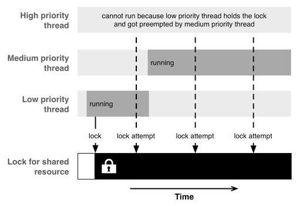

# 多线程

## 互斥锁

同一时刻，只允许一个线程访问。每个访问共享资源的线程，首先需要获取共享资源的互斥锁，一旦线程完成了对资源的操作，会释放掉互斥锁。

OC中的属性修饰符```atomic```就是互斥锁。

**锁的竞争**:当一个或者多个线程尝试获取一个已经被别的线程获取过了的锁。

### 优先级翻转



低优先级的任务首先获取了资源锁时，高优先级在访问资源时会被阻塞，这时如果有个中优先级的任务（不需要访问共享资源），那么它可能会被优先执行，因为此时它的优先级是最高的，高优先级任务是阻塞的。中优先级可能会阻塞着低优先级任务，导致其不能释放资源锁，进而影响到高优先级一直处于等待资源锁的状态。

# 问题

1. 为什么主线程不能更新UI？

	答：Opengl 原本的设计不支持多线程操作，视图框架为了方便事件处理和视图渲染实现简单，为了防止误操作，所以在视图操作的api中都加入线程判断，非主线程操作会报错。

	