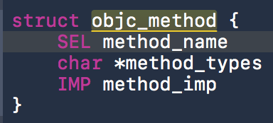

# Runtime

## 类的结构

```
typedef struct objc_class *Class;

struct objc_class {
    Class isa;
    Class super_class;
    const char *name;
    long version;
    long info;
    long instance_size;
    struct objc_ivar_list *ivars;
    struct objc_method_list **methodLists;
    struct objc_cache *cache;
    struct objc_protocol_list *protocols;
};
```

## 关于isa的理解


```
struct category_t {
    const char *name;
    classref_t cls;
    struct method_list_t *instanceMethods;
    struct method_list_t *classMethods;
    struct protocol_list_t *protocols;
    struct property_list_t *instanceProperties;
    method_list_t *methodsForMeta(bool isMeta) {
        if (isMeta) return classMethods;
        else return instanceMethods;
    }
    property_list_t *propertiesForMeta(bool isMeta) {
        if (isMeta) return nil; // classProperties;
        else return instanceProperties;
    }
};
```

* 由上图可知：实例变量的isa指向的是类，而类的isa指向的是元类（metaClass）。
* 由代码可知：isMeta为YES，返回的是classMethods，反之返回instanceMethods。

由此分析：**实例方法存放在类中，由类结构体可以看出。而类方法存放在元类（metaClass）里。

## 方法缓存 struct objc_cache *cache

类的所有缓存都存在metaclass上，所以每个类都只有一份方法缓存，而不是每一个类的object都保存一份。

从父类中继承的方法，也会存在类本身的方法缓存中。当父类的对象调用那个方法的时候，会在父类的metaclass中缓存一份。

**方法缓存限制**

这个问题翻了下runtime的源码：[runtime-cache](https://github.com/opensource-apple/objc4/blob/master/runtime/objc-cache.mm)

```
static void cache_fill_nolock(Class cls, SEL sel, IMP imp, id receiver){
  //  省略
      if (cache->isConstantEmptyCache()) {
          // Cache is read-only. Replace it.
          cache->reallocate(capacity, capacity ?: INIT_CACHE_SIZE);
      }else if (newOccupied <= capacity / 4 * 3) {
          // Cache is less than 3/4 full. Use it as-is.
      }else {
          // Cache is too full. Expand it.
          cache->expand();            //  1
      }
  //插入数据省略
}

void cache_t::expand(){
    uint32_t oldCapacity = capacity();
    uint32_t newCapacity = oldCapacity ? oldCapacity*2 : INIT_CACHE_SIZE;   //  2
    if ((uint32_t)(mask_t)newCapacity != newCapacity) {     //  3
        // mask overflow - can't grow further
        // fixme this wastes one bit of mask
        newCapacity = oldCapacity;
    }
    reallocate(oldCapacity, newCapacity);
}

/* Initial cache bucket count. INIT_CACHE_SIZE must be a power of two. */
enum {
    INIT_CACHE_SIZE_LOG2 = 2,
    INIT_CACHE_SIZE      = (1 << INIT_CACHE_SIZE_LOG2)
};

#if __LP64__
typedef uint32_t mask_t;  // x86_64 & arm64 asm are less efficient with 16-bits
#else
typedef uint16_t mask_t;
#endif

```
由源码可以看出：

1. 当缓存已满时，调用expand()方法进行扩容。
2. 计算新的缓存个数，INIT_CACHE_SIZE由下面代码可以看出是一个枚举值为4。
3. 计算完新的缓存大小，进行了两次强转之后判断是否与原值相等。-强转为mask-t类型，在64位下uint32_t类型。-强转为uint32_t类型。**结论：缓存的最大限制为2^mask_t**

**类的方法为什么存成一个数组，而不是散列表**

* 散列表是无序的，OC方法列表是有序的，OC查找方法是会顺着list依次寻找，并且category方法的优先级高于本身，所以要保证category方法在前面。如果用hash，则顺序无法保证。（同时解释了为什么category的方法优先级高）
* 散列表是有空槽的，会浪费空间。
* list的方法还保存了除了selector和imp之外其他属性。（**下面代码**）

```
struct objc_cache {
    uintptr_t mask;            /* total = mask + 1 */
    uintptr_t occupied;
    cache_entry *buckets[1];
};
typedef struct {
    SEL name;     // same layout as struct old_method
    void *unused;
    IMP imp;  // same layout as struct old_method
} cache_entry;
```

**方法列表是数组，缓存列表是散列表**

* 类的方法列表是数组，需要保证顺序。
* 方法缓存是散列表，要保证效率，检索快。

经测试：当存在Category中的方法和类中方法名相同时，Category的方法总是排在类中的方法之前。（这就是Cagegory方法的优先级高于类中方法的原因）。

方法列表的顺序部分和load的顺序有关，先是方法，然后是getter、setter方法。如果方法重名，category方法在前。


## SEL与IMP，Method，Ivar，property。

**SEL：**是用字符串表示的某个对象的方法（虚拟表中指向某个函数指针的字符串）

**IMP：**表示的是指向函数实现的指针。

**Method：**是SEL+IMP+类型


**Ivar:**实例变量

**property:**实例变量+setter+getter

## 关联属性

### 方法

* objc_setAssociatedObject(id object, const void *key, id value, objc_AssociationPolicy policy)
* objc_getAssociatedObject(id object, const void *key)：获取对象关联值
* objc_removeAssociatedObjects(id object)：移除对象的所有关联

```
object: 目标对象
key：键
value：关联值
policy：关联策略
```

### 关联策略

objc_AssociationPolicy：一共有以下几种关联策略。

```
typedef OBJC_ENUM(uintptr_t, objc_AssociationPolicy) {
    OBJC_ASSOCIATION_ASSIGN = 0,           /**< Specifies a weak reference to the associated object. */
    OBJC_ASSOCIATION_RETAIN_NONATOMIC = 1, /**< Specifies a strong reference to the associated object.
                                            *   The association is not made atomically. */
    OBJC_ASSOCIATION_COPY_NONATOMIC = 3,   /**< Specifies that the associated object is copied.
                                            *   The association is not made atomically. */
    OBJC_ASSOCIATION_RETAIN = 01401,       /**< Specifies a strong reference to the associated object.
                                            *   The association is made atomically. */
    OBJC_ASSOCIATION_COPY = 01403          /**< Specifies that the associated object is copied.
                                            *   The association is made atomically. */
};
```

分别就是：assign,nonatomic retain,notatomic copy, retain, copy。

### 内部剖析

```
class AssociationsManager {
    AssociationsHashMap &associations() //hash map，所有的关联引用，对象指针 -> PtrPtrHashMap.
};

//关联
class ObjcAssociation {
    uintptr_t policy()  //策略
    id value()  //值
};
```

系统管理着一个关联管理者AssociationsManager，AssociationsManager内部有个AssociationsHashMap属性，这是一个hashmap，以对象指针为key，以“这个对象所有的关联引用map”对象为value，“这个对象所有的关联引用map”是以设置的key为关联键，以ObjcAssociation为值，ObjcAssociation包涵关联值和策略。

> **问题思考：用runtime 关联一个属性，这个属性什么时候释放?**
> 
> * 当直接调用objc_removeAssociatedObjects方法时。
> * 当销毁对象的时候，会调用objc_destructInstance方法，最终还是会调用移除关联对象的方法。


#### _objc_builtin_selectors 系统内嵌的sel

runtime源码 [objc-sel.m/_objc_builtin_selectors] 定义了系统的sel