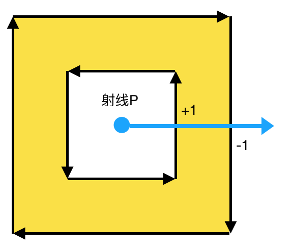
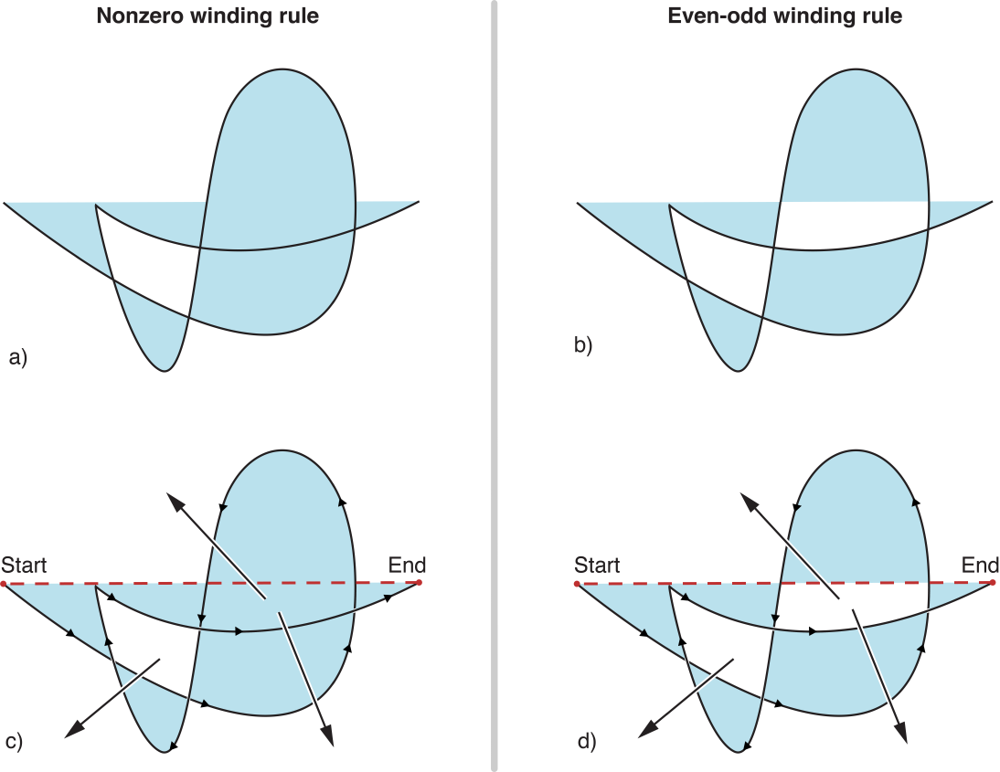

# Winding Rules

在实现一个镂空的效果时，发下路径的方向，会影响最终实现的效果，所以进一步研究了一下。

当填充路径所包含的区域时，NSBezierPath 会通过缠绕规则来判断需要填充的区域。通过给定区域内的任意一点到路径外画一条射线，根据与路径的交叉数判断点是否在区域内。

缠绕规则：

* NSNonZeroWindingRule：非零缠绕。射线从左到右每交叉路径一次+1，从右到左每交叉一次-1。如果最终交叉数为0，则该点在路径之外；如果交叉数不为0，则在路径之内。默认缠绕规则。
* NSEvenOddWindingRule：奇偶缠绕。计算射线与路径的交叉总数，如果为偶数，则在路径之外；如果为奇数，则在路径之内，需要填充。

填充操作适用于开放式路径和闭合路径。开放式路径会从路径的**最后一个点到第一个点**创建一个隐式的线（不渲染），来闭合路径。

> 文档中描述是从第一个点到最后一个点，但是根据分析与文档上的图以及实验，图与结果相同，但是描述错误，下面会详细介绍。如果是我理解错误，恳请指出。

[本文demo](https://github.com/yisimeng/WindingRules)

## 闭合路径

### 1. 非零缠绕：外边框和内边框同一方向

```
    CGRect aRect = CGRectMake(100, 100, 200, 200);
    UIBezierPath * aPath = [UIBezierPath bezierPathWithRect:aRect];
    CGRect bRect = CGRectInset(aRect, 50, 50);
    UIBezierPath * bPath = [UIBezierPath bezierPathWithRect:bRect];
    
    [aPath appendPath:bPath];
    
    CAShapeLayer * shapeLayer = [CAShapeLayer layer];
    shapeLayer.path = aPath.CGPath;
    shapeLayer.fillColor = [UIColor yellowColor].CGColor;
    
    [self.view.layer addSublayer:shapeLayer];
```


内部的点向外画射线，由于两个贝塞尔曲线是同向，射线由右至左跨过路径两次，aRect 以内的所有的点的射线交叉数只有两种情况：0-1=-1，或者0-1-1=-2。都不为0，所以内部的点都在路径之内，需要渲染。

### 2. 非零缠绕：内边框与外边框反向

```
// - (UIBezierPath *)bezierPathByReversingPath;  将路径翻转。
// 上面代码只需要修改 bPath
UIBezierPath * bPath = [[UIBezierPath bezierPathWithRect:bRect] bezierPathByReversingPath];
```



分为两种情况：
* bPath 以内的点的射线与路径交叉只有一种：0+1-1=0，因此 bPath 内部的点都在路径最终路径之外，bPath 以内的点不需要渲染。
* bPath 以外 aPath 以内的点的射线与路径交叉有两种：0-1=-1，或者0+1+1-1=1。两种情况都不为0，所以在路径之内，需要渲染。

### 奇偶缠绕规则

奇偶缠绕规则下，与内外路径方向无影响。默认 fillRule 为非零，添加如下代码。

```
shapeLayer.fillRule = kCAFillRuleEvenOdd;
```

只判断射线与路径的交叉，所以有两种情况：
* bRect内部的点，射线与路径的交叉有两个，为偶数，所以不在范围内，不需要渲染。
* bRect之外aRect以内，射线与路径的交叉数可能为1或3，为奇数，所以需要渲染。

## 开放式路径



盗取苹果文档的图来分析一下，图 c、d 中的射线，按照从上到下从 左->右 命名为 p1,p2,p3。

### 非零缠绕规则下 图c：
* p1 从 左->右 穿过隐式路径，在从 左->右 穿过路径，，0+1+1=2，在路径之内，需要渲染。
* p2 先是从 左->右 穿过路径，再从 右->左 穿过，0+1-1=0，不在路径之内，不需要渲染。
* p3 两次从 左->右 穿过路径，0+1+1=2，在路径之内，需要渲染。

> 这里分析一下**隐式线**的方向问题，修改一下 p2 的方向为垂直向上。
> * 隐式线的方向是 start->end，首先从 右->左 穿过路径，然后还是从 右->左 穿过隐式线，0-1-1=-2，不为0，应该是属于路径之内，需要渲染的，与原结果冲突。
> * 隐式线的方向是 end->start，首先从 右->左 穿过路径，然后从 左->右 穿过隐式线，0-1+1=0，为0不在路径内，不需要渲染，与原结果相同。

### 奇偶缠绕规则下 图d

* p1 穿过隐式线和一次路径，共两次，偶数，不在范围内，不会渲染。
* p2和p3 穿过两次路径，共两次，偶数，不在范围内，不会渲染。
