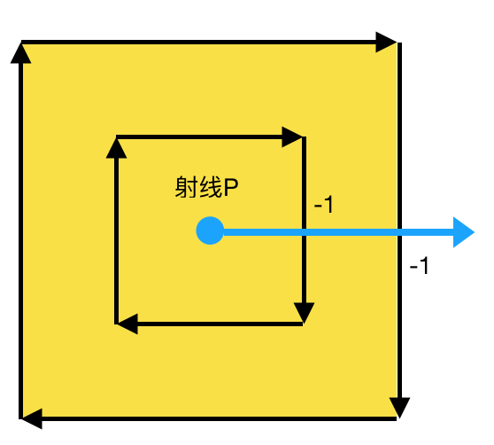

# Winding Rules

当填充路径所包含的区域时，NSBezierPath 会通过缠绕规则来判断需要填充的区域。通过给定区域内的任意一点到路径外画一条射线，根据与路径的交叉数判断点是否在区域内。

缠绕规则：

* NSNonZeroWindingRule：非零缠绕。射线从左到右每交叉路径一次+1，从右到左每交叉一次-1。如果最终交叉数为0，则该点在路径之外；如果交叉数非0，则在路径之内。默认缠绕规则。
* NSEvenOddWindingRule：奇偶缠绕。计算射线与路径的交叉总数，如果为偶数，则在路径之外；如果为奇数，则在路径之内，需要填充。

填充操作适用于开放式路径和闭合路径。开放式路径会从路径的第一个点到最后一个点创建一个隐式的线（这条线不渲染），来使其成为闭合路径。

## 非零缠绕

### 1. 外边框和内边框同一方向，

```
    CGRect aRect = CGRectMake(100, 100, 200, 200);
    UIBezierPath * aPath = [UIBezierPath bezierPathWithRect:aRect];
    CGRect bRect = CGRectInset(aRect, 50, 50);
    UIBezierPath * bPath = [UIBezierPath bezierPathWithRect:bRect];
    
    [aPath appendPath:bPath];
    
    CAShapeLayer * shapeLayer = [CAShapeLayer layer];
    shapeLayer.path = aPath.CGPath;
    shapeLayer.fillColor = [UIColor yellowColor].CGColor;
    
    [self.view.layer addSublayer:shapeLayer];
```



内部的点向外画射线，由于两个贝塞尔曲线是同向，射线由右至左跨过路径两次，aRect 以内的所有的点的射线交叉数只有两种情况：0-1=-1，或者0-1-1=-2。都不为0，所以内部的点都在路径之内，需要渲染。

### 2. 内边框与外边框反向

```
// - (UIBezierPath *)bezierPathByReversingPath;  将路径翻转。
// 上面代码只需要修改 bPath
UIBezierPath * bPath = [[UIBezierPath bezierPathWithRect:bRect] bezierPathByReversingPath];
```


分为两种情况：
* bPath 以内的点的射线与路径交叉只有一种：0+1-1=0，因此 bPath 内部的点都在路径最终路径之外，bPath 以内的点不需要渲染。
* bPath 以外 aPath 以内的点的射线与路径交叉有两种：0-1=-1，或者0+1+1-1=1。两种情况都不为0，所以在路径之内，需要渲染。
