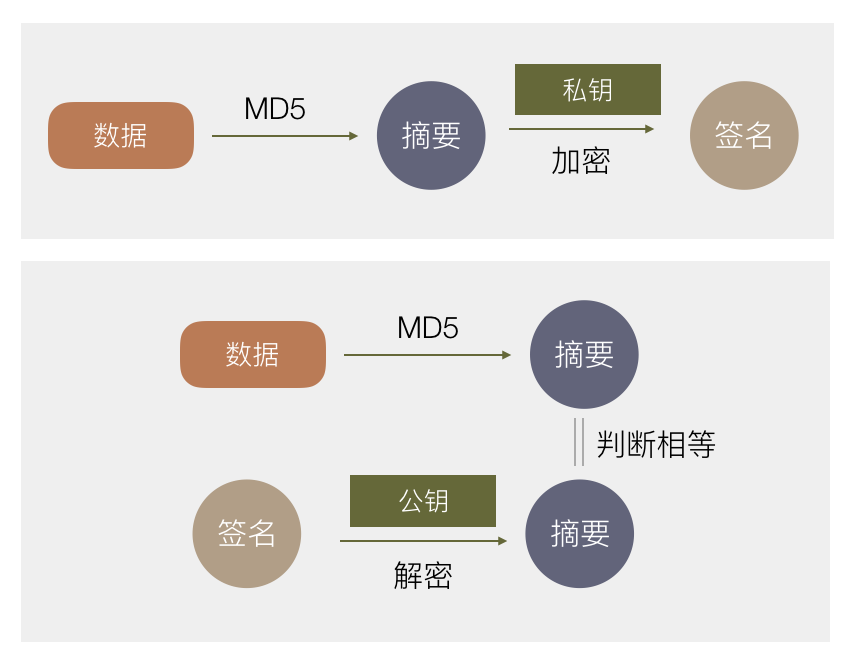

# 密码

## 对称加密

加密解密使用同一密钥，也称为但密钥加密。常用的加密算法有：AES，3DES，DES。

* 速度快，算法公开，计算量小，加密速度快，效率高。
* 密码的管理和分配问题。加解密使用相同密钥，一方泄露，信息不安全。

### AES

AES是分组加密，即将明文分成组，每组长度相等，每次加密一组，直至结束。AES加密涉流程：明文和**初始密钥**进行异或->字节替代，行移位，列混淆，轮密钥加···（重复操作）···->字节替代，行移位，轮密钥加（最后一轮不执行列混淆）。每一步都是可逆的，所以解密就是逆向操作。

AES标准规范中，分组的长度只能是128位（16字节），密钥的长度可以为：128位（8字节），192位（24字节）256位（32字节）。密钥的长度越长，加密的轮数也越多。

AES的处理单位为字节

* 128位的明文分组被分成16个字节，用以字节为单位的正方形矩阵表示，称为状态矩阵。每一轮状态矩阵内容不断发生变换，最后作为密文输出。
* 128位的密钥也是以矩阵表示。矩阵每一列被称为1个32位比特字。通过密钥扩展被排成44个字的序列(W[0..43])，前四个元素(W[0..3])为**初始密钥**。后面40个分为10组，每组4个32位bit字（共128bit），分别用于后面10轮的加密运算种的轮密钥加。

#### 1. 字节替代

AES的字节替代就是一个简单的查表。AES定义了一个固定的16x16[S盒和Sˉ盒](https://wenku.baidu.com/view/2d11d7cdad51f01dc281f189.html)。加密时，将该字节的高4位作为行，低4位作为列，从S盒或者Sˉ盒种取值替换原值。

#### 2. 行移位

行移位就是左循环移位操作，矩阵第0行左移0个字节，第1行左移1个字节...以此类推。

#### 3. 列混淆

将行移位之后的矩阵与固定矩阵相乘，得到混淆后的矩阵。

#### 4. 轮密钥加

将密钥同矩阵数据进行逐位异或（不同为1，相同为0）。

#### 5.密钥扩展 （没懂）

[AES加密算法的详细介绍](http://blog.csdn.net/qq_28205153/article/details/55798628)

[AES加密实现](https://github.com/dhuertas/AES/blob/master/aes.c)

### DES

### 3DES

## 非对称加密

非对称加密有两个密钥，分别是公钥和私钥。使用公钥加密的数据，只有私钥能解密；私钥加密的数据，公钥才能解密。常用RSA。

## 数字签名

数字签名表明数据经过我的认证，事后不会抵赖。

使用非对称加密进行数据传输（A->B）：

1. A 对数据进行HASH，得到信息摘要（1），再使用自己的私钥对信息摘要进行加密，得到数字签名。
2. 将数字签名同数据一同发送给 B 。
3. B 对数据进行HASH，得到信息摘要（2），使用 A 的公钥对数字签名进行解密，得到A 的信息摘要（1），对两份信息摘要进行对比。

如果 信息摘要（1）= 信息摘要（2），则证明数据确实由 A 发送，并且没有被修改。

> 注： 对数据进行哈希是有必要的，因为非对称加密的原理，使得加密的数据不能太大（一般不能大于1024/2048位），因为经过MD5获取信息摘要后的数据是定长的（标准为128位）.

## 数字证书

由于不确定 A 的公钥是否是真的，所以需要一个权威的第三方机构对公钥进行公证，这个第三方机构就是**证书中心（certificate authority，简称CA）**。CA 使用自己的私钥对 A 的公钥及一些相关信息进行加密，生成**数字证书**。

使用 CA 的公钥对数字证书进行解密，就可以获取到 A 的公钥，也就可以确定数字签名是否真的是 A 的。