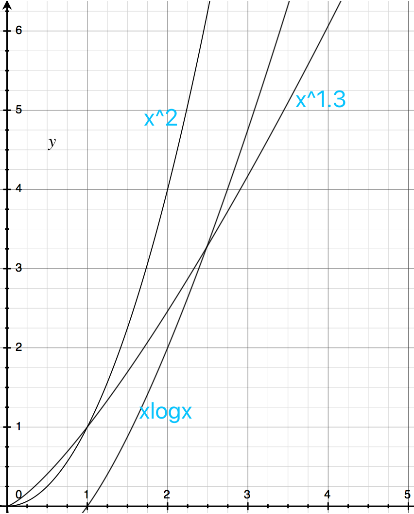
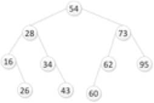

#### bitmap算法

将数组元素的值映射到bit位上。

```
如果数组元素是[2,7,1,5]
输入 2：
0000 0100
输入 7：
1000 0100
输入 1：
1000 0110
输入 5：
1010 0110

映射完成之后是：1010 0110。由左向右取值为：1，2，5，7。
```

* 优点： 效率高，不需要进行比较。占用内存少，占用内存为 N/8。
> 1字节=8位，可以表示8个数字，所以为 N/8 位。一个int是4B，32位，所以存储空间为 4N。

* 缺点： 

----

## 算法与程序设计 


### 1. 待排序元素规模较小时，宜选取哪种排序算法效率最高（） 。

A:堆排序  B:归并排序  C:冒泡排序  D:希尔排序

>   解析：
> 
    排序  时间复杂度   空间复杂度
    堆排序 O(nlogn)    O(1)    不稳定，n大时效果较好
    归并排序 O(nlogn)   O(n)    稳定，n大时效果较好
    冒泡排序 O(n^2)     O(1)    稳定，n小时效果较好
    希尔排序 O(n^1.3)   O(1)    不稳定，n中小时效果较好
    
> 但是根据抛物线来看只有在n<3的时候堆排或者归并更好，但是归并空间复杂度较高。



> 原答案为C：应该在题目上加上限定：要求算法稳定，且额外空间最小情况下，选C。
    
### 2. 直接插入排序算法适用于下列哪种情形下（） C。

A:待排序数据规模较大时    B:任意情况  C:待排序数据大部分已排序时  D:其他几项都不对
    
> 考察的是对插入排序算法理解。插入排序是对未排序元素，在已排序序列中从后向前依次比较，找到合适位置进行插入，插入排序时间复杂度为n^2，所以数据量越小，且大部分有序情况下较好。因此选C。

### 3. 设二叉排序树由(54,28,16,34,73,62,95,60,26,43)构成如下图二叉树，则在该树中查找任意指定元素的平均查找长度为（ ）。B 

A:1.2   B:2.9   C:4.1   D:5.4    
    
   > 解析：考察的是二叉排序树的平均查找长度。二叉排序树查找成功的平均查找长度为: 
ASL = [(n+1)/n] * log(n+1) - 1 = [(10+1)/10] * log(10+1) - 1 = 1.1 * log11 - 1 ≈ 2.9。

### 4. 已知序列(50,30,80,20,40,90,35,85,32,88) ，按照依次插入的方法生成二叉排序树，则在该树中查找关键字值为35的结点所需比较次数为（）。B 

A:3 B:4  C:5   D:6
    
    解析：考察生成二叉排序树。按照次序生成二叉排序树，关键字35在第4层，因此选B。
    
### 5. 下面程序的执行结果为（）B
	
A: 11	B:13	C:17	D:21 

```
#include <stdio.h>   

int func(int n)
{
    if (n < 2)
        return n;
    return func(n - 1) + func(n - 2);
}

int main ()   
{
    printf("%d\n",func(7)); 

    return 0;  
}  
```

> 解析：考察的是斐波那切数列。后一个数等于前俩个数的和：1，1，2，3，5，8，13，21。第7位，是13。

### 6. 下列程序执行func(15,20)的结果为（）D

A:8	B:16	C:24	D:32

```
int func(int i, int j){
    if (i <= 0 || j <= 0)
        return 1;
    return 2 * func( i-3, j/2);
}
```

> 解析：2的指数函数，初始i=15，减5次3才会等于0触发if，j=20，同样除以2取整，要5次以后才等于0触发if，因此就是2的5次幂，2^5=32。

### 7. 使用快速排序算法对序列9,1,3,8,23,5,7,10,29,19进行排序，基准数取9，则第1趟排序后的结果为（）B

A: 9,1,3,8,23,5,7,10,29,19
B: 7,1,3,8,5,9,23,10,29,19
C: 1,3,8,9,23,5,7,10,29,19
D: 9,1,3,8,23,5,7,10,19,29

> 解析：考查快排的核心思想。快速排序，就是选取一个基准值，通过一趟排序将序列中所有小于基准值的放于一侧，大于的放于另外一侧，分为两个序列，然后分别再取基准值，重复操作，已达到排序整个序列。因此基准数为9，所有小于9的应该在左侧，大于9的在右侧，选B。

### 8. 使用直接选择排序算法对序列18,23,19,9,23,15进行排序，第3趟排序后的结果为（）B

A: 9,23,19,18,23,15
B: 9,15,18,23,19,23
C: 18,19,23,9,23,15
D: 18,19,23,9,15,23

> 解析：考察的是选择排序的核心思想，从未排序的序列中选择最大（小）的元素，放于有序序列的末尾，所以第三趟排序之后前三个位置应该是有序的。选B。

### 9. 关于归并排序叙述正确的是（）AD

A: 归并排序使用了分治策略的思想
B: 归并排序使用了贪心策略的思想
C: 子序列的长度一定相等
D: 归并排序是稳定的

> 解析：考察的是归并排序的理解。归并排序是将长度为N的序列分为两个长度为N/2的序列，每个序列再分别再进行归并排序，将已有序的子序列合并，达到完整的有序序列，归并排序是稳定排序。

### 10. 对于初始关键字(67,66,77,82,78,51,58),使用二路归并排序,第一趟归并之后其序列变为（）B

A: 66,67,77,82,51,58,78
B: 66,67,77,82,51,78,58
C: 51,58,66,67,77,78,82
D: 67,66,77,78,82,51,58

> 解析：考察的是归并排序的理解。归并排序是将长度为N的序列分为两个长度为N/2的序列，每个序列再分别再进行归并排序，将已有序的子序列合并，达到完整的有序序列。因此一趟排序之后，序列应该是两两之间是有序的。分割之后应该是 67，66| 77，82 | 78，51 | 58，每个子序列再进行排序，选B

### 11. 下列哪种算法平均情况、最好情况和最坏情况下的时间复杂度都为o(n^2)（）B

A:直接选择排序	B:直接插入排序	C:冒泡排序	D:归并排序

> 解析：考察各种排序算法时间复杂度。
> 
> |排序方法|平均时间复杂度|最好|最坏|
> |:-:|:-:|:-:|:-:|
> |直接选择排序|O(n^2)|O(n)|O(n^2)|
> |直接插入排序|O(n^2)|O(n^2)|O(n^2)|
> |冒泡排序|O(n^2)|O(n)|O(n^2)|
> |归并排序|O(nlogn)|O(nlogn)|O(nlogn)|
> 插入排序是一次次从未排序序列中查找极值，放到有序序列的末尾，因此最好情况也是O(n^2)

### 12. 对n个元素用插入法建堆的时间复杂度是（）A

A: O(nlogn)	B: O(n)	C: O(logn)	D: O(n^2)

> 解析：考察maxHeapInsert。
> 从根结点开始，依次把结点插入堆中，当把新结点插入堆中时，需要对比父节点，如果大于父节点需要交换，通过节点调整，以保证插入结点后的堆依然是大根堆。最理想的情况下，每次插入的元素都是递减的，那么每个元素只需要和它的父结点比较一次，时间复杂度为O(n)。最坏情况下每次插入都要调整至根节点，复杂度为O(nlogn)。

### 13. 利用动态规划计算以下矩阵连乘：A1(20\*25)、A2(25\*5)、A3(5\*15)、A4(15\*10)、A5(10\*20)、A6(20\*25)。	A

A: (A1A2)(((A3A4)A5)A6)	B: (A1A2A3)((A4A5)A6)	C: (((A1((A2A3)A4))A5)A6)	D: (A1A2)((A3(A4A5))A6)

> 解析：
> 
> 1. 当矩阵A的列数（column）等于矩阵B的行数（row）时，A与B可以相乘。
> 2. 矩阵C的行数等于矩阵A的行数，C的列数等于B的列数。
> 3. 乘积C的第m行第n列的元素等于矩阵A的第m行的元素与矩阵B的第n列对应元素乘积之和。
> 上述A的连乘方式次数最少。

### 14. 适用动态规划算法求解的问题一般应具有哪些特征（） AB

A: 满足最优化原理	B:	待解决问题存在重叠子问题	C: 具有最优子结构性质	D: 问题规模缩小到一定程度后就容易解决

> 解析：动态规划的使用条件：
> 1. 最优化原理：一个最优化策略的子策略总是最优的；
> 2. 无后效性：某阶段状态一旦确定，就不受这个状态以后决策的影响；
> 3. 子问题的重叠性：子问题之间是不独立的，一个子问题在下一阶段决策中可能被多次使用到。
> 第三条非必要条件，但如果没有这条，动态规划与其他算法相比就不具备优势。

### 15. 以下算法中哪些算法的空间复杂度为O(1)（）AD

A:选择排序	B:快速排序 C:基数排序	D:堆排序

> 解析：排序算法的空间复杂度
> 
> |排序方法|空间复杂度|
> |:-:|:-:|
> |选择排序|O(1)|
> |快速排序|O(nlogn)|
> |基数排序|O(n+k)|
> |堆排序|O(1)|

### 16. 下列哪些排序方法在最坏的情况下的时间复杂度为n^2（）BCD

A:归并排序	B:快速排序	C:冒泡排序	D:插入排序

> 解析：排序算法的时间复杂度
> 
> |排序方法|最坏复杂度|
> |:-:|:-:|
> |归并排序|O(nlogn)|
> |快速排序|O(n^2)|
> |冒泡排序|O(n^2)|
> |插入排序|O(n^)|