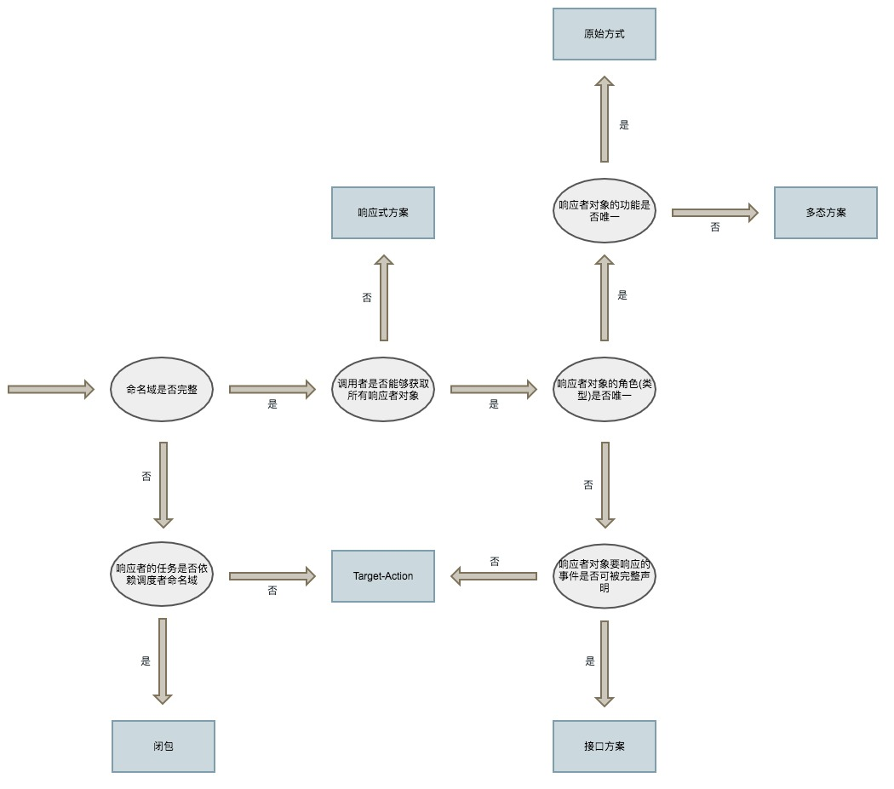

# 对象间传值

### 1. 直接传值

直接传值的方式需要清楚地知道两方具体类型，缺少灵活性。

### 2. 多态和接口（轻度抽象）

**多态** 面向对象的三要素之一，把方法或者属性声明在父类中，然后派生出不同子类，重载方法，调用者无需知道响应者具体类型完成调度（父类指针指向子类对象调用）。

优点：基类提供默认实现。缺点：有可能出现超级父类；支持多继承语言中可能出现**菱形继承**；一个对象只能作为一类调度者的响应者（？）。

**接口** 也称协议（protocol），声明一个协议，由响应者实现，调用者可以在不知道响应者类型的情况下完成调度。

优点：只要有对象实现了协议，就能被不同对象调用；侵入性更小，原来的类不需要引入额外的东西。缺点：没有默认实现，调用前需判断方法是否被实现了。 

> swift 中的 protocol extension，使接口可以添加默认实现，同时可选绑定也自动判断了方法是否被实现了。

这两种方式可使响应者不受类型限制，但是还是都需要提供接口的声明，只有调用者知道响应者的命名域，知道响应者声明的内容，才能够调用。

### 3. target-action

protocol 经常有不止一个方法，但是这些方法不一定都是当前需要的（虽然可以通过optional方法修饰）。当只需要一个执行方法的时候，可以使用target-action。

借助runtime的特性，可以做到无视命名域，不需要任何的声明，但是需要拿到响应者的实例对象（target）和方法，动态的去根据sel去查询方法的实现。

### 4. 响应式

上面的交互方式基本是命令式的。区别在于命令式是让你去做某些事，是被动的；响应式是通知你做某些事，是主动的。delegate 与 notification 的区别之一就是：前者是命令式，后者是响应式。

响应式就是Observer模式的应用， notification/signal/KVO 都属于响应式。响应式中，响应者需要知道接收的指令（NotificationName），和执行的方法，仍然没有脱离命名域。响应式要求响应者必须注册通知或者监听信号，随之而来的就是注册和取消监听的管理。响应式需要对数据流有严格的控制，否则可能导致数据混乱，不该响应的响应者被触发，引发一系列错误。

> 注意响应式和函数式的关系。

### 5. 闭包

闭包的特性使得其可以捕捉到闭包的上下文，可以跨越命名域（前提是闭包的参数不受命名域影响，例如使用系统的对象：NSDictionary）。

闭包的一个缺陷在于，要求调用和回调在同一上下文，在哪里调用的闭包，回调就会在哪里。 UITableView 的 dataSource 使用的是 delegate 的模式，使得其可以被抽离成一个对象。

关于选择交互的方式

参考：https://casatwy.com/communication_patterns.html