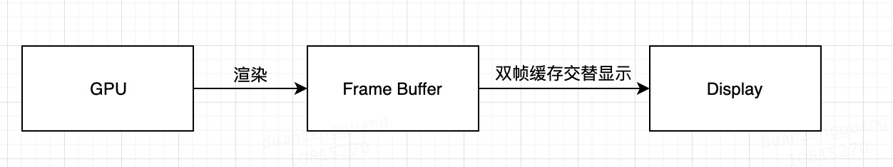
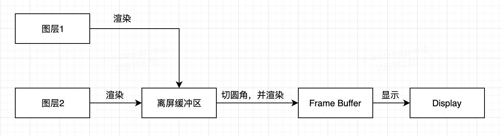

# 渲染

### 渲染机制

CPU将要显示的内容计算好提交到GPU进行渲染，渲染结果存放在帧缓冲区，当需要显示时，视频控制器会逐帧从缓冲区读取数据，进行数模转换后传递给显示器。

### GPU渲染的方式

* On-Screen Rendering: 当前屏幕渲染，GPU在用于显示的帧缓冲区进行渲染
* Off-Screen Rendering：常说的离屏渲染，GPU在当前显示的缓冲区之外创建一块缓冲区进行渲染。

**Note** 除了这两种渲染方式之外，还有一种渲染方式，**CPU渲染**。即使用Core Graphics进行绘制，过程在CPU中执行，渲染得到的bitmap交由GPU进行显示。Core Graphics通常是线程安全的，可以进行异步绘制，显示时再回调主线程。

## 触发离屏渲染的方式

设置以下属性：

* shouldRasterize（光栅化）
* masks（遮罩）
* shadows（阴影）
* edge antialiasing（抗锯齿）
* group opacity（不透明）
* 复杂形状设置圆角等
* 渐变
* 绘制了文字的layer(UILabel，CATextLayer，Core Text等)。

**图层属性的混合体在未合成之前不能直接在屏幕中绘制，但是一些效果并不能一次渲染完成，所以就需要进行离屏渲染**。离屏渲染是在屏幕外的上下文中被渲染（GPU或者CPU），所以离屏渲染总是会造成性能的消耗。OpenGL需要在重新开辟缓冲区，并进行上下文的切换。

Rander Server渲染遵循[画家算法]()，按次序输出到frame buffer，后一层会覆盖前一层，最终得到渲染结果。如果其中有半透明图层，还需要进行混合计算最终颜色。

正常情况下显示流程：

1. GPU将结果渲染到后帧缓冲区。
2. 屏幕进行前后帧缓冲区切换进行显示。

离屏渲染的流程（以设置切圆角为例）：，，最终对得到的混合结果进行切圆角，并将结果画到 frame buffer中。

1. 创建一个offscreen frame buffer。
2. 将图层依次绘制到内存中，并计算出结果。
3. 对结果进行切圆角。
4. 将结果绘制到帧缓冲中。
5. 屏幕显示。

阴影是在所有图层都组合渲染完成之后，添加在最底层的，因此也需要离屏渲染。

##### Off-Screen Buffer 空间限制

屏幕像素点的2.5倍。

#### 光栅化

概念：将图片转化为一个个的栅格组成的图像，即每个像素对应帧缓冲区的一个像素。

光栅化触发离屏渲染的同时，会将结果缓存起来，如果对应的layer或者sublayers没有发生改变，下一帧会进行复用。

使用光栅化时，可以开启“Color Hits Green and Misses Red”来检查，绿色表示缓存被复用，红色表示被重复创建。

以下是光栅化的使用注意：

* 如果不能被复用，则不需要进行光栅化。
* 如果图层是动态的，会频繁的被修改，也不需要光栅化。
* 100ms没有被复用，则会被丢弃。
* 超过离屏渲染的空间限制2.5倍屏幕像素，也会失效。

#### iOS的优化

iOS9之前UIImageView和UIButton设置圆角都会触发离屏渲染。

iOS9之后UIButton设置圆角会触发离屏渲染，而UIImageView中png图片设置圆角不会触发，如果设置其他阴影效果等还是会触发。

##### 离屏渲染的优势

1. 一些效果（阴影等），不能一次渲染完成，需要额外的空间保存中间状态。
2. 效率，离屏渲染有额外的空间开销，可以提前渲染保存到 Offscreen Buffer中，进行复用。

