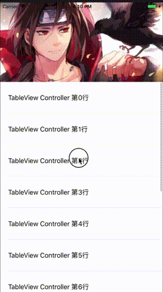

## YSMContainerView

一个易于接入的，思路简洁的仿微博简书等个人页的轮子。

[Demo地址](https://github.com/yisimeng/YSMContainerView)

起因：以前去新浪面试被问到了微博个人页的实现，应该是考查手势冲突的问题，当时回答的怎么样已经忘了。回来之后自己实现了一个，但是扩展性始终不太好，最近仿照UITableView的方式重新实现了一个版本。



### 介绍

**YSMContainerView：** 继承自UIView，是整个视图的容器。

**YSMContainerViewDataSource：**YSMContainerView的代理dataSource，负责提供内容。

```
@required
// 子视图控制器的个数
- (NSInteger)numberOfViewControllersInContainerView:(YSMContainerView *)containerView;
// 根据下标传入响应的子视图
- (UIViewController<YSMContainrerChildControllerDelegate> *)containerView:(YSMContainerView *)containerView viewControllerAtIndex:(NSInteger)index;

@optional
// header view
- (UIView *)headerViewForContainerView:(YSMContainerView *)containerView;
```

**YSMContainerViewDelegate：**YSMContainerView 的事件代理。

```
@optional
// Horizontal Scroll
// 将要水平滚动
- (void)containerView:(YSMContainerView *)containerView willScrollToChildControllerIndex:(NSInteger)index;
// 水平滚动完成
- (void)containerView:(YSMContainerView *)containerView didScrollToChildControllerIndex:(NSInteger)index;

// Vertical Scroll
// 垂直滚动
- (void)containerView:(YSMContainerView *)containerView didScrollContentOffset:(CGPoint)contentOffset;
```

**YSMContainrerChildControllerDelegate：**子视图控制器需要实现的方法，YSMContainerView 通过这个代理从子视图控制器中获取 ScrollView（或者其子类）。只有一个方法

```
// 返回子视图控制器的可滚动的视图
- (UIScrollView *)childScrollView;
```

#### 使用

1. 创建child controller并实现YSMContainrerChildControllerDelegate代理方法。
	
	```
	- (UIScrollView *)childScrollView{
 	   return self.tableView;
	}
	```
	
2. YSMContainerView初始化。

	```
	self.containerView = [[YSMContainerView alloc] initWithFrame:self.view.bounds];
    self.containerView.dataSource = self;
    [self.view addSubview:self.containerView];
	```
3. 实现YSMContainerViewDataSource代理的方法。

	```
	- (NSInteger)numberOfViewControllersInContainerView:(YSMContainerView *)containerView {
		return self.viewControllers.count;
}
- (UIViewController<YSMContainrerChildControllerDelegate> *)containerView:(YSMContainerView *)containerView viewControllerAtIndex:(NSInteger)index {
    	UIViewController<YSMContainrerChildControllerDelegate> * childController = self.viewControllers[index];
    	return childController;
}
	```

> 注意：第一步中，因为使用的是懒加载，YSMContainrerChildControllerDelegate代理方法不能返回空，如果在`viewDidLoad`方法中或之后初始化，会在添加sub view 时获取不到ScollView，而出现空页面。

### 实现思路

滚动分为横向滚动和纵向滚动，横向切换子视图控制器，纵向滚动子视图控制器。采用的是UICollectionView嵌套 UIScrollView（或者其子类）的方式。

* 设置UICollectionViewCell的大小为当前页面的大小，UICollectionView只可以横向滚动。

	```
	flowLayout.scrollDirection = UICollectionViewScrollDirectionHorizontal;
	flowLayout.itemSize = self.bounds.size;
	flowLayout.minimumLineSpacing = 0;
	flowLayout.minimumInteritemSpacing = 0;
	```

* 纵向直接滚动子视图控制器的UIScorllView（或者其子类）。

主要实现难点在于处理横向和纵向滚动，于是整理主要思路：

1. header view 是添加到 UICollectionView 上，而不是child controller的header。
2. 根据header的高度，依次设置子视图控制器ScrollView的 contentInset 属性，使其内容向下偏移header的高度，呈现header是在child controller 上的效果。
	
	```
	UIEdgeInsets contentInset = UIEdgeInsetsMake(_headerViewHeight, 0, 0, 0);
	childScrollView.contentInset = contentInset;
	childScrollView.scrollIndicatorInsets = contentInset;
	```
	
3. 设置UICollectionView的delegate方法，在横向滚动时，获取偏移量，设置 headerView 同步横向偏移，实现headerView 始终保持在子视图的上方。

	```
	- (void)scrollViewDidScroll:(UIScrollView *)scrollView{
    	// 水平移动时 控制header水平同步位移
	    CGRect headerFrame = self.containerHeaderView.frame;
	    headerFrame.origin.x = scrollView.contentOffset.x;
    	self.containerHeaderView.frame = headerFrame;
}
	```
	
4. 在添加child controller时，添加观察者，监听子视图ScrollView的`contentOffset`属性。
	
	```
	[childScrollView addObserver:self forKeyPath:@"contentOffset" options:NSKeyValueObservingOptionNew context:nil];
	```

5. 纵向滚动时，会出发KVO监听方法，在回调中可以拿到当前子视图控制器的偏移量，然后设置header同步纵向偏移，实现滚动headerView的效果。

	```
	- (void)observeValueForKeyPath:(NSString *)keyPath ofObject:(id)object change:(NSDictionary<NSKeyValueChangeKey,id> *)change context:(void *)context{
	    if (![keyPath isEqualToString:@"contentOffset"]) {
        	return [super observeValueForKeyPath:keyPath ofObject:object change:change context:context];
    	}
    	CGPoint contentOffset = [[change valueForKey:NSKeyValueChangeNewKey] CGPointValue];
		// 根据contentOffset的位置同步偏移 header view，设置悬停位置。
	}
	```

### TODO

1. 进一步封装，子视图添加 tab，点击切换子视图，tab随子视图滚动切换。
2. 指定移除子视图控制器。
3. 完善YSMContainerViewDelegate方法。

## 参考

[HJTabViewController](https://github.com/panghaijiao/HJTabViewController) 

