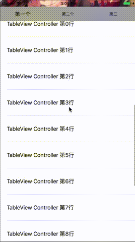

## YSMContainerView

[Demo地址](https://github.com/yisimeng/YSMContainerView)

起因：以前去新浪面试被问到了微博个人页的实现，应该是考查手势冲突的问题，当时回答的怎么样已经忘了。回来之后自己实现了一个，但是扩展性始终不太好，最近仿照UITableView的方式重新实现了一个版本。



### 介绍

**YSMContainerView：** 继承自UIView，是整个视图的容器。

**YSMContainerViewDataSource：**YSMContainerView的代理dataSource，负责提供内容。

```
@required
// 子视图控制器的个数
- (NSInteger)numberOfViewControllersInContainerView:(YSMContainerView *)containerView;
// 根据下标传入响应的子视图
- (UIViewController<YSMContainrerChildControllerDelegate> *)containerView:(YSMContainerView *)containerView viewControllerAtIndex:(NSInteger)index;

@optional
// header view
- (UIView *)headerViewForContainerView:(YSMContainerView *)containerView;
```

**YSMContainerViewDelegate：**YSMContainerView 的事件代理。

```
@optional
// Horizontal Scroll
// 将要水平滚动
- (void)containerView:(YSMContainerView *)containerView willScrollToChildControllerIndex:(NSInteger)index;
// 水平滚动完成
- (void)containerView:(YSMContainerView *)containerView didScrollToChildControllerIndex:(NSInteger)index;

// Vertical Scroll
// 垂直滚动
- (void)containerView:(YSMContainerView *)containerView didScrollContentOffset:(CGPoint)contentOffset;
```

**YSMContainrerChildControllerDelegate：**子视图控制器需要实现的方法，YSMContainerView 通过这个代理从子视图控制器中获取 ScrollView（或者其子类）。只有一个方法

```
// 返回子视图控制器的可滚动的视图
- (UIScrollView *)childScrollView;
```

#### 使用

1. 创建子视图控制器，子视图控制器需要遵循YSMContainrerChildControllerDelegate代理。

2. 初始化之后，向YSMContainerView的viewControllers传入子视图控制器数组

	```
	self.viewControllers = @[child1,child2,child3];
	```
	
3. 实现YSMContainerViewDataSource的方法。

### 实现思路

滚动分为横向滚动和纵向滚动，横向切换子视图控制器，纵向滚动子视图控制器。采用的是UICollectionView嵌套 UIScrollView（或者其子类）的方式。

* 设置UICollectionViewCell的大小为当前页面的大小，UICollectionView只可以横向滚动。

	```
flowLayout.scrollDirection = UICollectionViewScrollDirectionHorizontal;
flowLayout.itemSize = self.bounds.size;
flowLayout.minimumLineSpacing = 0;
flowLayout.minimumInteritemSpacing = 0;
	```

* 纵向直接滚动子视图控制器的UIScorllView（或者其子类）。

主要实现难点在于横向滚动和纵向滚动容易冲突，整理主要思路：

1. HeaderView 添加到 UICollectionView 上，根据header的高度，依次设置子视图控制器ScrollView的 contentInset属性，使其内容向下偏移header的高度。
2. 设置UICollectionView的delegate方法，在横向滚动时，获取偏移量，设置 headerView 同步横向偏移，实现headerView 始终保持在子视图的上方。
3. 在添加子视图时，添加观察者，监听子视图ScrollView的`contentOffset`属性。
4. 纵向滚动时，会出发KVO监听方法，在回调中可以拿到当前子视图控制器的偏移量，然后设置header同步纵向偏移，实现滚动headerView的效果。


## 参考

[HJTabViewController](https://github.com/panghaijiao/HJTabViewController)

