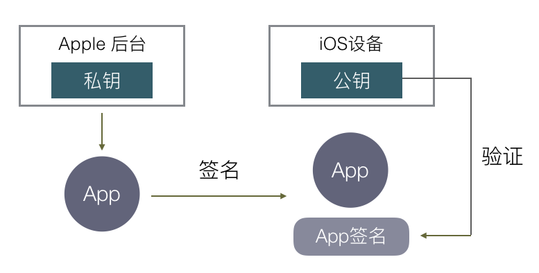
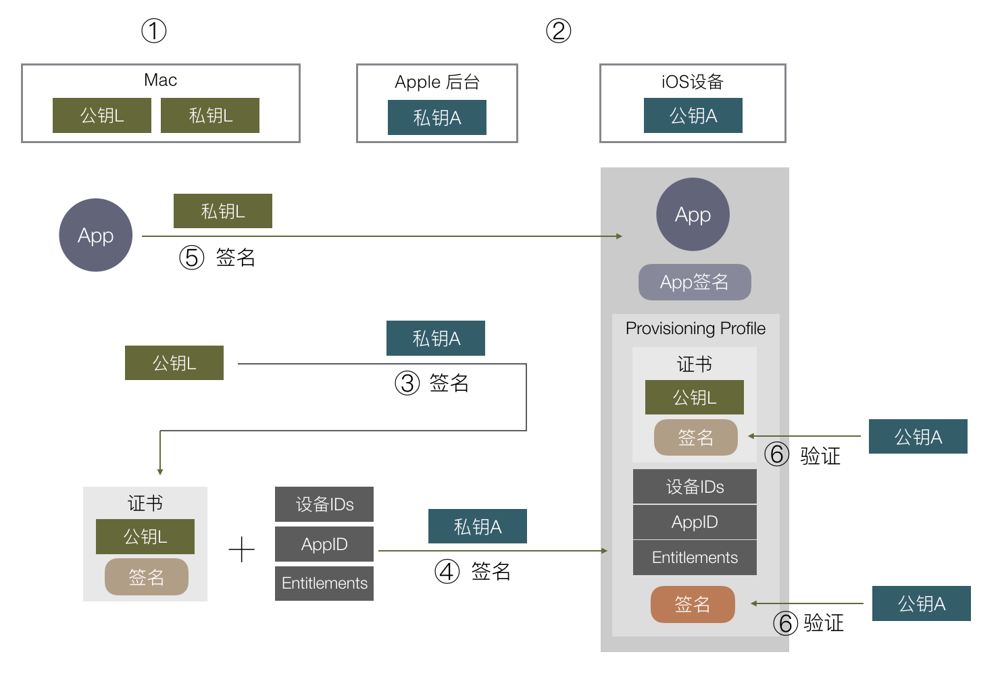

# iOS 签名

[原文地址](http://wereadteam.github.io/)

因为苹果的安全策略，通过签名机制保证手机上的每个app都是经过苹果认证的。安装方式：

1. 通过App Store安装。
2. 开发者可以通过Xcode安装。
3. Ad-Hoc 测试证书打包的app，数量限制100。
4. In-House 企业版证书打包app，信任企业证书后可以使用。

### 一、 通过App Store安装



1. 由苹果生成一对公私钥，公钥内置与iOS设备中，私钥由苹果保管。
2. 开发者上传APP给苹果审核后，苹果用私钥对APP数据进行签名，发布至App Store。
3. iOS设备下载APP后，用公钥进行验证，若正确，则证明APP是有苹果认证过的。

### 二、通过Xcode安装（真机调试）

由于不需要提交苹果审核，所以苹果没办法对app进行签名，因此苹果采用了双重签名的机制。Mac电脑有一对公私钥，苹果还是原来的一对公私钥。

 （图文步骤不一定相同）

1. 开发时需要真机测试时，需要从钥匙串中的证书中心创建**证书请求文件（CSR）**，并传至苹果服务器。
2. Apple使用私钥对 CSR 签名，生成一份包含Mac公钥信息及Apple对它的签名，被称为证书（CER：即开发证书，发布证书）。
3. 编译完一个APP后，Mac电脑使用私钥对APP进行签名。
4. 在安装APP时，根据当前配置把CER证书一起打包进APP。
5. iOS设备通过内置的Apple的公钥验证CER是否正确，证书验证确保Mac公钥时经过苹果认证的。
6. 再使用CER文件中Mac的公钥去验证APP的签名是否正确，确保安装行为时经过苹果允许的。

苹果只是确定这里的安装行为是否合法，不会验证APP内容是否修改。

> 注： 证书请求文件（CertificateSigningRequest.certSigningRequest），用于绑定电脑，文件中应该有Mac电脑的公钥。

### 三、通过Ad-Hoc正式打包安装

Xcode打包app生成ipa文件，通过iTunes或者蒲公英等第三方发布平台，安装到手机上。流程步骤基本和真机调试相同，差别在于第4步：

1. 开发时需要打包测试或发布时，需要从钥匙串中的证书中心创建**证书请求文件（CSR）**，并传至苹果服务器。
2. Apple使用私钥对 CSR 签名，生成一份包含Mac公钥信息及Apple对它的签名，被称为证书（CER：即开发证书，发布证书）。
3. 编译完一个APP后，Mac电脑使用私钥对APP进行签名。
4. 编译签名完之后，要导出ipa文件，导出时，需要选择一个保存的方法（App Store/Ad Hoc/Enterprice/Development），就是选择将上一步生成的CER一起打包进APP。
5. iOS设备通过内置的Apple的公钥验证CER是否正确，证书验证确保Mac公钥时经过苹果认证的。
6. 再使用CER文件中Mac的公钥去验证APP的签名是否正确，确保安装行为时经过苹果允许的。

### 四、In-House企业版证书打包

企业版证书签名验证流程和Ad-Hoc差不多。只是企业版不限制设备数，而且需要用户在iOS设备上手动点击信任证书。

### 附加一些东西

通过真机调试安装和证书打包安装，不加限制，可能会导致被滥用（不通过App Store，只通过第三方发布平台就能安装），因此苹果加了两个限制：在苹果注册过的设备才可以安装；签名只针对某一个App。

在上述第4步，打包证书进app中时，还需要加上允许安装的设备ID和APP对应的APPID等数据（Profile文件）。 

根据数字签名的原理，只要数字签名通过验证，第 5 步这里的设备 IDs / AppID / Mac公钥 就都是经过苹果认证的，无法被修改，苹果就可以限制可安装的设备和 APP，避免滥用。

苹果还要控制iCloud/push/后台运行等，这些都需要苹果授权签名，苹果把这些权限开关统称为：**Entitlements**，去让苹果授权。

因此证书中可能包含很多东西，不符合规定的格式规范，所以有了Provisioning Profile（描述文件），描述中包含了证书以及其他所有的信息及信息的签名。

## 总结一下最终流程

（图文步骤不一定相同）

1. Mac电脑和苹果分别有一套公私钥，苹果的私钥在后台，公钥存放在每个iOS设备，Mac的私钥存放在电脑，公钥后面要发送给苹果服务器。
2. Mac从钥匙串生成CSR（就是或者包含公钥），上传至苹果服务器。
3. 苹果服务器使用私钥对CSR进行签名，得到包含Mac公钥以及其签名的数据，称为证书（Cer文件）。
4. 从苹果后台申请Appid，配置好设备ID列表及APP的其他权限信息，使用苹果的私钥进行签名生成**描述文件**（Provisioning Profile），和第 3 步的证书Cer一并下载到Mac安装，钥匙串会自动将Cer与之前生成CSR文件的私钥关联（公私钥对应）。
5. 使用Mac编译App后，使用Mac私钥进行签名，并把 描述文件 打包进APP，文件名为```embedded.mobileprovision```。
6. 安装app时，iOS设备取得证书，使用内置的Apple私钥去验证Cer及```embedded.mobileprovision```文件。
7. 保证Cer及```embedded.mobileprovision```是经过苹果认证之后，从Cer中取出Mac公钥，验证APP签名，及设备id列表、权限开关是否对应。

> 1. 其他人想要编译签名App时应怎么做? 
>> 简单就是把私钥给他。私钥也是从 钥匙串 中导出，就是```.p12```文件，其他Mac导入私钥后就可以正常使用了。

> 2. 查看ipa包中注册的设备ID
>> 解压.ipa文件，得到app数据包，显示包内容，找到```embedded.mobileprovision```文件所在目录，运行命令```security cms -D -i embedded.mobileprovision```

名词概念：
1. 证书请求文件（CertificateSigningRequest.certSigningRequest）：本地公钥。
2. 证书（Cer）：公钥及苹果签名后的信息。
2. Entitlements：包含了 App 权限开关列表。
3. p12：本地私钥，可以导入到其他电脑。
4. Provisioning Profile：包含了 证书 / Entitlements 等数据，并由苹果后台私钥签名的数据包。