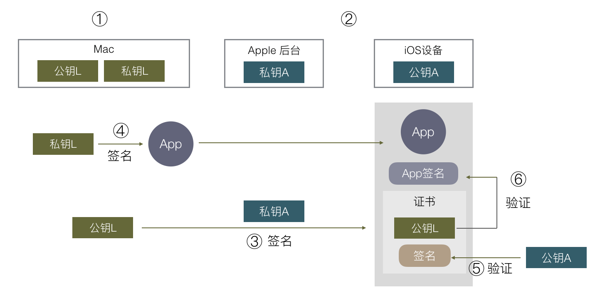

# iOS 签名

因为苹果的安全策略，通过签名机制保证手机上的每个app都是经过苹果认证的。安装方式：

1. 通过App Store安装。
2. 开发者可以通过Xcode安装。
3. Ad-Hoc 测试证书打包的app，数量限制100。
4. In-House 企业版证书打包app，信任企业证书后可以使用。

### 一、 通过App Store安装

1. 由苹果生成一对公私钥，公钥内置与iOS设备中，私钥由苹果保管。
2. 开发者上传APP给苹果审核后，苹果用私钥对APP数据进行签名，发布至App Store。
3. iOS设备下载APP后，用公钥进行验证，若正确，则证明APP是有苹果认证过的。

### 二、通过Xcode安装（真机调试）

由于不需要提交苹果审核，所以苹果没办法对app进行签名，因此苹果采用了双重签名的机制。Mac电脑有一对公私钥，苹果还是原来的一对公私钥。

1. 开发时需要真机测试时，需要从钥匙串中的证书中心创建**证书请求文件（CSR）**，并传至苹果服务器。
2. Apple使用私钥对 CSR 签名，生成一份包含Mac公钥信息及Apple对它的签名，被称为证书（CER：即开发证书，发布证书）。
3. 编译完一个APP后，Mac电脑使用私钥对APP进行签名，导出时，需要选择一个保存的方法（App Store/Ad Hoc/Enterprice/Development），就是选择将上一步生成的CER一起打包进APP。
4. 在安装APP时，iOS设备通过内置的Apple的公钥验证CER是否正确。
5. 再使用CER文件中Mac的公钥去验证APP的签名是否正确。

苹果只是确定这里的安装行为是否合法，不会验证APP内容是否修改。

> 注： 证书请求文件（CertificateSigningRequest.certSigningRequest），用于绑定电脑，文件中应该有Mac电脑的公钥。