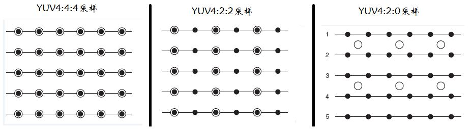

# 图片格式

## YUV

YUV格式有两大类：planar和packed。
* **planar**：将每个像素点的Y,U,V分量交叉排列并以像素点为单元连续的存放在同一数组中，通常几个相邻的像素组成一个宏像素（macro-pixel）
* **packed**：使用三个数组分开连续的存放Y,U,V三个分量，即Y,U,V分别存放在各自的数组中。

### YUV主流格式

YUV码流的存储格式与采样的方式有关，主流为三种：YUV4:4:4，YUV4:2:2，YUV4:2:0。

YUV采样表示法，以黑点表示采样该像素点的Y分量，以空心圆圈表示采用该像素点的UV分量。


* **YUV 4:4:4** 表示没有色度频道下采样，即一个Y分量对应一个U和V分量
* **YUV 4:2:2** 表示2:1的水平下采样，没有垂直下采样，即两个Y分量对应一个U和V分量
* **YUV 4:2:0** 表示2:1的水平下采样，2:1的垂直下采样，即四个Y分量对应一个U分量和Y分量

一个分辨率为8X4的YUV图像，它们的格式如下图：

YUV420sp格式


YUV420p格式


### YUV数据存储

1. 4:4:4 (32位) :包含alpha通道 数据大小为： width\*height\*4Byte
2. 4:2:2 (16位) :数据大小为：width\*height\*2Byte
3. 4:2:0 (16位) :数据大小为：width\*height\*2Byte
3. 4:2:0 (12位) :数据大小为：width\*height\*3/2Byte

## RGB

### RGB数据存储

RGB24格式是每个像素的三个分量是连续存储的，即：R1 G1 B1 R2 G2 B2...。占用存储空间为width\*height\*3byte


## BMP

BMP 格式内部存储的就是RGB数据。BMP格式是由BITMAPFILEHEADER、BITMAPINFOHEADER、RGB像素数据共3个部分构成。

其前两部分的结构如下：
```
typedef  struct  tagBITMAPFILEHEADER{
    unsigned short int  bfType;       //位图文件的类型，必须为BM
    unsigned long       bfSize;       //文件大小，以字节为单位
    unsigned short int  bfReserverd1; //位图文件保留字，必须为0
    unsigned short int  bfReserverd2; //位图文件保留字，必须为0
    unsigned long       bfbfOffBits;  //位图文件头到数据的偏移量，以字节为单位
}BITMAPFILEHEADER;

typedef  struct  tagBITMAPINFOHEADER{
    long biSize;                        //该结构大小，字节为单位
    long  biWidth;                     //图形宽度以象素为单位
    long  biHeight;                     //图形高度以象素为单位
    short int  biPlanes;               //目标设备的级别，必须为1
    short int  biBitcount;             //颜色深度，每个象素所需要的位数
    short int  biCompression;        //位图的压缩类型
    long  biSizeImage;              //位图的大小，以字节为单位
    long  biXPelsPermeter;       //位图水平分辨率，每米像素数
    long  biYPelsPermeter;       //位图垂直分辨率，每米像素数
    long  biClrUsed;            //位图实际使用的颜色表中的颜色数
    long  biClrImportant;       //位图显示过程中重要的颜色数
}BITMAPINFOHEADER;
```

BMP采用的是小端（Little Endian）存储方式。这种存储方式中“RGB24”格式的像素的分量存储的先后顺序为B、G、R。


## 格式转换

### RGB24 -> BMP

由于BMP存储的是RGB的数据，所以转换的主要工作为：
1. 写文件头
2. 将RGB数据的R和B调换。

### RGB24 -> YUV420P

转换公式：
* Y= 0.299\*R+0.587\*G+0.114*B
* U=-0.147\*R-0.289\*G+0.463*B
* V= 0.615\*R-0.515\*G-0.100*B

在转换的过程中有以下几点需要注意：

1. RGB24存储方式是Packed，YUV420P存储方式是Packed。
2. U，V在水平和垂直方向的取样数是Y的一半
